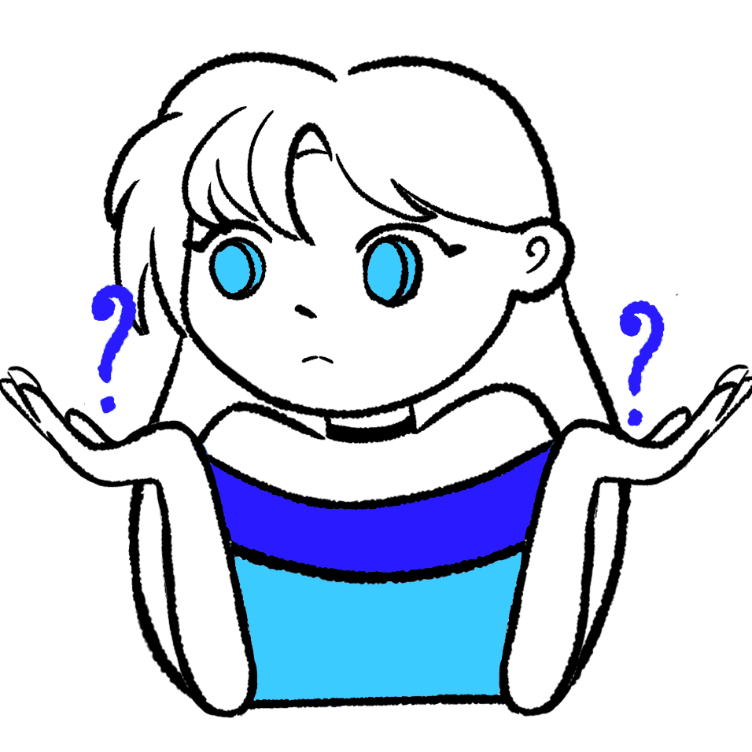
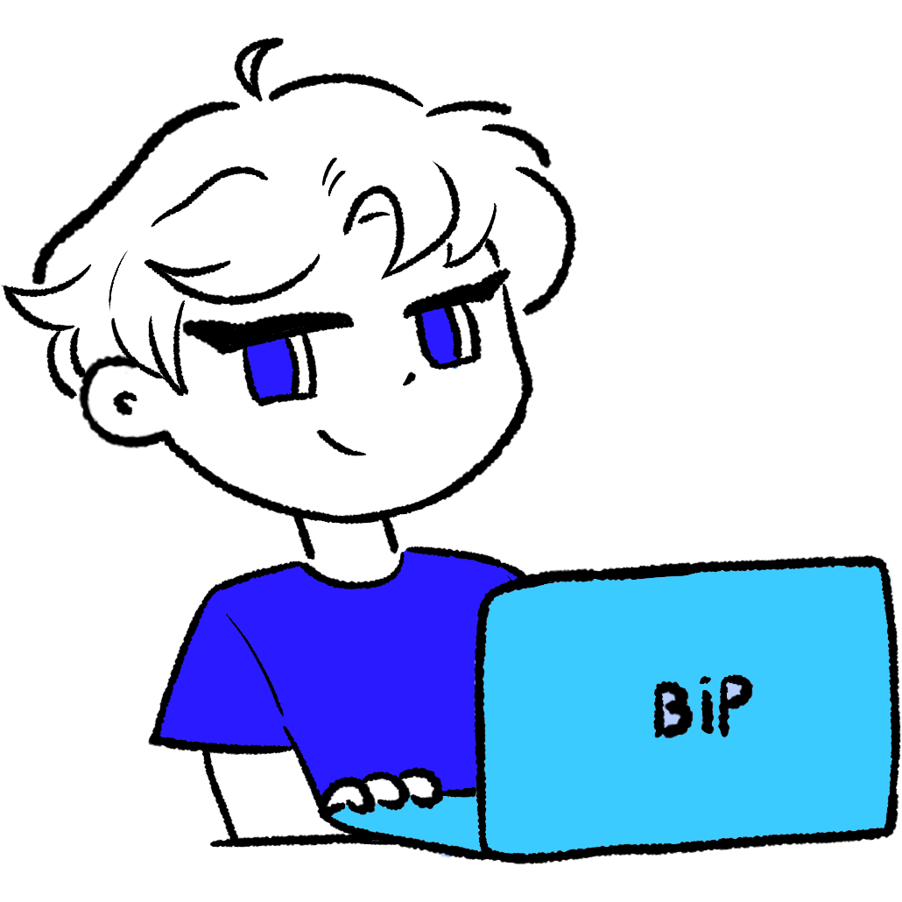
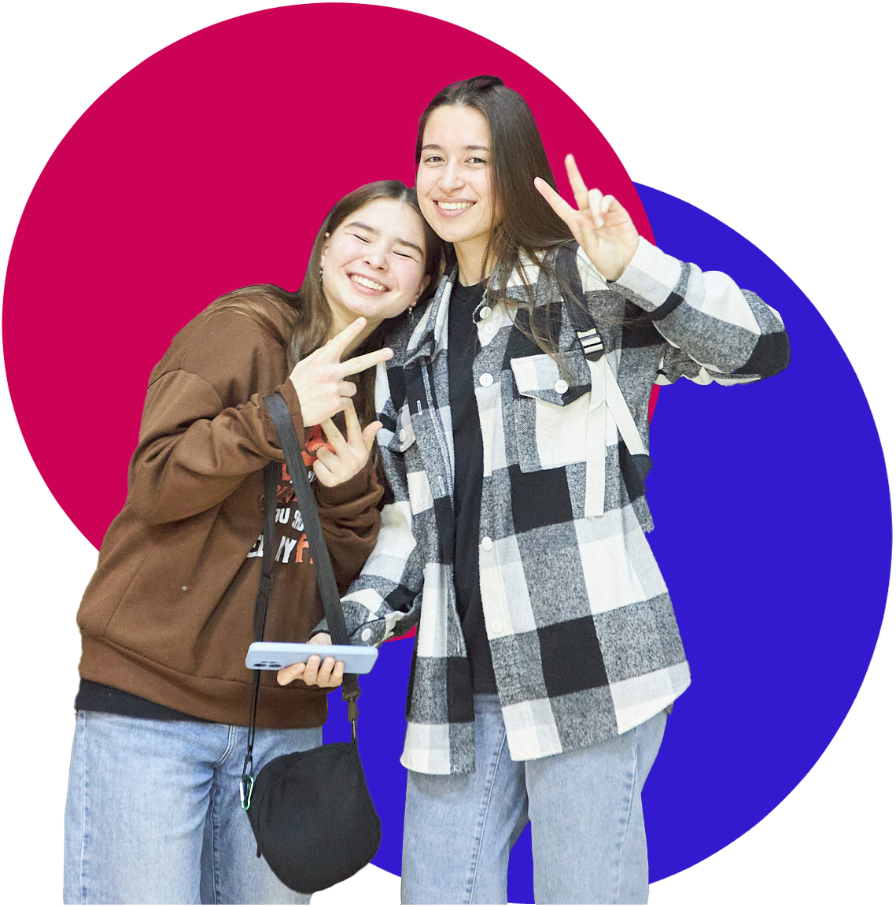
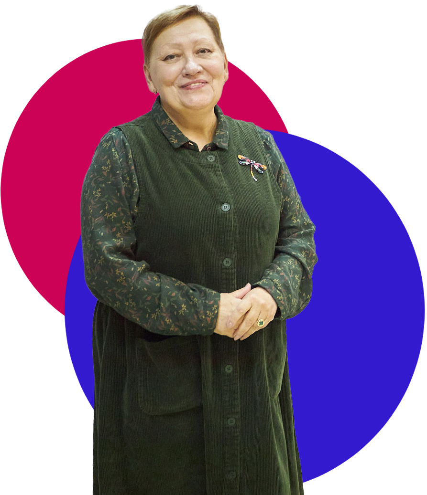

# Документация к HTML блоку "header" - Шапка

## Описание

Блок `header` представляет собой заголовок веб-страницы Института компьютерных наук и технологий Пермского государственного национального исследовательского университета. Этот блок включает в себя навигационное меню, логотип, кнопки для мобильной и десктопной версии сайта, а также текстовую информацию о вузе.

## Структура

### 1. Основной контейнер `header.header`

Основной контейнер блока, содержащий все элементы заголовка.

### 2. Навигация `nav.nav`

Содержит элементы навигационного меню и вспомогательные элементы управления. Атрибут `id="menu"` используется для ссылок и идентификации.

#### 2.1. Контейнер навигации `div.content.nav-content`

Включает логотип, навигационную панель, кнопку поступления и элементы управления для мобильной версии.

#### 2.2. Логотип `img.logo`

Изображение логотипа университета. Используется атрибут `src="img/logo.png"` для указания пути к файлу изображения и `alt="logo"` для текстового описания.

#### 2.3. Навигационная панель `div.nav-bar`

Содержит ссылки на основные разделы сайта. Каждый элемент навигации представлен в виде `div.nav-item`, внутри которого находится ссылка `a.menu-link`.

##### Ссылки навигации:

- `href="#about"` - Об институте
- `href="#faculties"` - Направления
- `href="#advantages"` - Преимущества
- `href="#tracks"` - Треки
- `href="#curriculum"` - Учебные планы
- `href="#about_entering"` - Про поступление
- `href="#comments"` - Отзывы

#### 2.4. Кнопка "Поступить" `button.go_iknt.menu-link`

Кнопка для перехода на страницу поступления. Внутри кнопки находится текстовый элемент `p`.

#### 2.5. Бургер-меню `div.box_menu`

Элемент управления для мобильной версии сайта. Внутри содержит три полоски `div.menubar` для визуализации бургер-меню. При нажатии вызывает функцию `menu_active()`.

### 3. Навигация для мобильной версии `div.nav-bar-mobile`

Дополнительная навигационная панель, адаптированная для мобильных устройств. Содержит те же ссылки, что и `nav-bar`.

#### 3.1. Секция для мобильной версии `section#modal-message-mobile`

Секция содержит кнопку для написания сообщения `button.modal-button`, идентифицируемую через `id="write-button"`.

### 4. Контент заголовка `div.head`

Содержит текстовый контент заголовка, включающий название университета и информацию о вузе.

#### 4.1. Контент внутри заголовка `div.head-content`

Включает текстовые элементы:

- Название университета: `h2.h2-head`
- Название института: `h1.h1-head`
- Описание: `h3.h3-head`

#### 4.2. Заголовок раздела "Об институте" `h2.about__h2.desktop`

Текстовый заголовок раздела, предназначенный для десктопной версии сайта.

скрипт `menu.js`

```javascript
// Проверяем, является ли устройство мобильным
const isMobile = window.matchMedia("(max-width: 1000px)").matches;
const isMobile_mobile = window.matchMedia("(max-width: 500px)").matches;
```
Описание:
Эти две строки используют метод `window.matchMedia` для проверки, соответствует ли ширина окна браузера определенным условиям. Переменная `isMobile` будет иметь значение true, если ширина окна меньше или равна 1000 пикселей, а переменная `isMobile_mobile` будет иметь значение `true`, если ширина окна меньше или равна 500 пикселей. Эти переменные будут использоваться для определения, какой код следует выполнять в зависимости от того, является ли устройство мобильным или нет.
```javascript
// Если устройство не мобильное, выполняем этот код
if (!isMobile) {
  var onMenu = false;
  var high = true;
  document.addEventListener("DOMContentLoaded", function () {
    // Получаем ссылку на элемент меню
    var menu = document.getElementById("menu");
    var timer;
    window.addEventListener("scroll", function () {
      // Сбрасываем таймер при прокрутке
      clearTimeout(timer);
      if (window.scrollY === 0) {
        // Если пользователь в самом верху страницы, не скрываем меню
        high = true;
        return;
      } else {
        high = false;
      }
      if (!high) {
        // Если не в верхней части страницы, показываем меню
        menu.style.transform = "translateY(0)";
        menu.style.transition = "transform 0.5s ease";
        // Устанавливаем таймер для скрытия меню через 3 секунды
        timer = setTimeout(function () {
          menu.style.transform = "translateY(-130%)";
        }, 3000);
      }
    });

    // Обработчик события наведения мыши на меню
    menu.addEventListener("mouseenter", function () {
      // Мышь на меню
      onMenu = true;
    });
    menu.addEventListener("mouseleave", function () {
      // Мышь покинула меню
      if (!high) {
        // Если не в верхней части страницы, скрываем меню через 3 секунды
        onMenu = false;
        timer = setTimeout(function () {
          menu.style.transform = "translateY(-130%)";
        }, 3000);
      }
    });

    // Обработчик события движения мыши
    document.addEventListener("mousemove", function (event) {
      if (event.clientY < window.innerHeight / 10) {
        if (onMenu) {
          // Если мышь на меню, показываем меню
          clearTimeout(timer);
          menu.style.transform = "translateY(0)";
        } else {
          if (!high) {
            // Если мышь не на меню и не в верхней части страницы,
            // показываем меню и устанавливаем таймер для его скрытия
            menu.style.transform = "translateY(0)";
            clearTimeout(timer);
            timer = setTimeout(function () {
              menu.style.transform = "translateY(-130%)";
            }, 3000);
          }
        }
      }
    });
  });
}
```
Описание:
Этот код выполняется только в том случае, если устройство пользователя не является мобильным (ширина окна больше 1000 пикселей).

Объявляются переменные `onMenu` и `high`, инициализированные значениями `false` и `true` соответственно.
Когда DOM полностью загружен, выполняется следующий код:

Получается ссылка на элемент меню с помощью document.getElementById`("menu")`.
Объявляется переменная `timer`, которая будет использоваться для таймера скрытия меню.
Добавляется обработчик события прокрутки `scroll` для окна window.

При прокрутке сбрасывается таймер `timer`.
Если пользователь находится в самом верху страницы `(window.scrollY === 0)`, то переменная `high` устанавливается в `true`, и функция возвращается, не выполняя остальной код.
В противном случае, переменная `high` устанавливается в `false`.
Если `high` равно `false` (пользователь не в верхней части страницы), то:

Меню становится видимым `(menu.style.transform = "translateY(0)")`.
Добавляется переходный эффект для меню `(menu.style.transition = "transform 0.5s ease")`.
Устанавливается таймер `timer` для скрытия меню через 3 секунды `(setTimeout)`.
Добавляется обработчик события `mouseenter` (наведение мыши) для элемента меню.

Когда мышь наводится на меню, переменная `onMenu` устанавливается в `true`.


Добавляется обработчик события `mouseleave` (покидание мыши) для элемента меню.

Когда мышь покидает меню и `high` равно `false` (пользователь не в верхней части страницы), то:

Переменная `onMenu` устанавливается в `false`.
Устанавливается таймер `timer` для скрытия меню через 3 секунды `(setTimeout)`.

Добавляется обработчик события `mousemove` (движение мыши) для документа.

Если координата Y мыши меньше 10% высоты окна `(event.clientY < window.innerHeight / 10)`, то:

Если onMenu равно `true` (мышь на меню), то:

Сбрасывается таймер `timer`.
Меню становится видимым `(menu.style.transform = "translateY(0)")`.


В противном случае, если `high` равно `false` (пользователь не в верхней части страницы), то:

Меню становится видимым `(menu.style.transform = "translateY(0)")`.
Сбрасывается таймер `timer`.
Устанавливается таймер `timer` для скрытия меню через 3 секунды `(setTimeout)`.

Таким образом, этот код управляет видимостью меню на не мобильных устройствах. Меню скрывается через 3 секунды после прокрутки страницы, если мышь не наведена на меню и пользователь не находится в верхней части страницы. Также меню показывается, если мышь находится в верхней части экрана.


```javascript
/* для работы меню*/
document.addEventListener("DOMContentLoaded", function () {
  const menuLinks = document.querySelectorAll(".menu-link");

  menuLinks.forEach((link) => {
    link.addEventListener("click", function (event) {
      // Предотвращаем стандартное поведение ссылки
      event.preventDefault();
      // Получаем целевой идентификатор из href ссылки
      const targetId = this.getAttribute("href");
      // Получаем целевой элемент по идентификатору
      const targetElement = document.querySelector(targetId);
      // Прокручиваем страницу к целевому элементу
      scrollTo(targetElement, targetId);
      // Закрываем мобильное меню
      closeMobileMenu();
    });
  });

  function scrollTo(element, targetId) {
    let offset;
    // Устанавливаем смещение в зависимости от целевого идентификатора
    if (targetId === "#about" || targetId === "#tracks") {
      offset = 200;
    } else {
      offset = 100;
    }
    // Получаем позицию целевого элемента с учетом смещения
    const elementPosition = element.offsetTop;
    const offsetPosition = elementPosition - offset;
    // Прокручиваем страницу к целевому элементу с плавной анимацией
    window.scroll({
      behavior: "smooth",
      left: 0,
      top: offsetPosition,
    });
  }

  function closeMobileMenu() {
    // Получаем ссылку на мобильное меню
    const mobileMenu = document.getElementById("menu");
    // Удаляем класс active у мобильного меню
    mobileMenu.classList.remove("active");
  }
});
```
Описание:
Этот фрагмент кода выполняется после полной загрузки DOM.

Получаются все ссылки меню с классом `.menu-link` с помощью `document.querySelectorAll(".menu-link")`.
Для каждой ссылки меню добавляется обработчик события `click`:

Предотвращается стандартное поведение ссылки с помощью `event.preventDefault()`.
Получается целевой идентификатор из атрибута `href` ссылки с помощью `this.getAttribute("href")`.
Получается целевой элемент по идентификатору с помощью `document.querySelector(targetId)`.
Вызывается функция `scrollTo` с передачей целевого элемента и идентификатора для плавной прокрутки страницы к этому элементу.
Вызывается функция `closeMobileMenu` для закрытия мобильного меню (если оно открыто).


Функция `scrollTo` принимает целевой элемент и идентификатор:

Устанавливается смещение `(offset)` в зависимости от целевого идентификатора. Для `#about` и `#tracks` смещение равно 200 пикселей, для остальных - 100 пикселей.
Получается позиция целевого элемента с учетом смещения `(elementPosition - offset)`.
Вызывается метод `window.scroll` с параметрами behavior: "smooth" для плавной анимации прокрутки, `left: 0` для сохранения горизонтального положения и `top: offsetPosition` для установки нового вертикального положения.


Функция `closeMobileMenu`:

Получается ссылка на мобильное меню с помощью `document.getElementById("menu")`.
У мобильного меню удаляется класс `active` с помощью `mobileMenu.classList.remove("active")`.


Таким образом, этот код добавляет обработчики событий клика для ссылок меню. Когда пользователь кликает на ссылку меню, предотвращается стандартное поведение ссылки, затем получается целевой элемент, к которому нужно прокрутить страницу, вызывается функция `scrollTo` для плавной прокрутки к целевому элементу, и вызывается функция `closeMobileMenu` для закрытия мобильного меню.
```javascript
if (isMobile) {
  let isAnim = false;

  function menu_active() {
    // Получаем ссылки на элементы меню и оверлей
    const menubar1 = document.querySelector(".menubar1");
    const menubar2 = document.querySelector(".menubar2");
    const menubar3 = document.querySelector(".menubar3");
    const nav_bar = document.querySelector(".nav-bar-mobile");
    const overlay = document.querySelector(".overlay");

    if (!isAnim) {
      // Если меню не анимируется (закрыто), открываем меню
      // Удаляем класс для анимации закрытия меню
      nav_bar.classList.remove("nav_bar_anim_return");
      // Добавляем класс для анимации открытия меню
      nav_bar.classList.add("nav_bar_anim");
      // Добавляем классы для анимации элементов меню
      menubar1.classList.add("menubar1_anim");
      menubar2.classList.add("menubar2_anim");
      menubar3.classList.add("menubar3_anim");
      // Удаляем класс для скрытия оверлея
      overlay.classList.remove("hidden");
      // Добавляем класс для показа оверлея
      overlay.classList.add("show");
      // Устанавливаем флаг, что анимация меню запущена
      isAnim = true;
    } else {
      // Если меню анимируется (открыто), закрываем меню
      // Удаляем класс для анимации открытия меню
      nav_bar.classList.remove("nav_bar_anim");
      // Добавляем класс для анимации закрытия меню
      nav_bar.classList.add("nav_bar_anim_return");
      // Удаляем классы для анимации элементов меню
      menubar1.classList.remove("menubar1_anim");
      menubar2.classList.remove("menubar2_anim");
      menubar3.classList.remove("menubar3_anim");
      // Удаляем класс для показа оверлея
      overlay.classList.remove("show");
      // Добавляем класс для скрытия оверлея
      overlay.classList.add("hidden");
      // Сбрасываем флаг, что анимация меню запущена
      isAnim = false;
    }
  }
}
```
Описание:
Этот фрагмент кода выполняется только на мобильных устройствах `(если isMobile равно true)`.

Объявляется переменная `isAnim` и инициализируется значением `false`. Эта переменная будет использоваться для отслеживания состояния анимации меню.
Объявляется функция `menu_active`, которая отвечает за открытие и закрытие мобильного меню с анимацией.
Внутри функции `menu_active`:

Получаются ссылки на элементы меню `(menubar1, menubar2, menubar3, nav_bar)` и оверлея `(overlay)` с помощью `document.querySelector(".overlay")`.

Внутри функции `menu_active`:

Получается ссылка на элемент оверлея с помощью `document.querySelector(".overlay")`.
Проверяется состояние флага `isAnim`, который отслеживает, анимируется ли меню в данный момент.


Если `isAnim` равно `false` (меню закрыто):

Удаляется класс `nav_bar_anim_return` у элемента `nav_bar` (для предотвращения анимации закрытия меню).
Добавляется класс `nav_bar_anim` к элементу `nav_bar` (для анимации открытия меню).
Добавляются классы анимации к элементам меню `(menubar1_anim, menubar2_anim, menubar3_anim)`.
Удаляется класс `hidden` у элемента `overlay` (для показа оверлея).
Добавляется класс `show` к элементу `overlay` (для показа оверлея).
Устанавливается флаг `isAnim` в `true` (меню анимируется).


Если `isAnim` равно `true` (меню открыто):

Удаляется класс `nav_bar_anim` у элемента `nav_bar` (для предотвращения анимации открытия меню).
Добавляется класс `nav_bar_anim_return` к элементу `nav_bar` (для анимации закрытия меню).
Удаляются классы анимации у элементов меню `(menubar1_anim, menubar2_anim, menubar3_anim)`.
Удаляется класс `show` у элемента `overlay` (для скрытия оверлея).
Добавляется класс `hidden` к элементу `overlay` (для скрытия оверлея).
Сбрасывается флаг `isAnim` в `false` (меню не анимируется).


Таким образом, функция `menu_active` переключает классы `CSS` для элементов меню и оверлея, чтобы открыть или закрыть мобильное меню с анимацией. Флаг `isAnim `используется для отслеживания состояния анимации меню, чтобы избежать конфликтов при повторном вызове функции.


# Документация к блоку "Об институте"

## HTML структура

### Основной контейнер

```html
<section class="about" id="about"></section>
```

Элемент `<section>` с классом `about` и идентификатором `about`. Этот блок представляет собой секцию, содержащую информацию об институте.

### Заголовок

```html
<h2 class="about__h2 mobile">Об институте</h2>
```

Заголовок второго уровня с классом `about__h2 mobile`, отображается только на мобильных устройствах.

### Контентный контейнер

```html
<div class="content about__content"></div>
```

Контейнер с классами `content` и `about__content`, который включает весь контент секции.

### Изображения

```html
<div class="about__img">
  
  
  
</div>
```

Блок с изображениями. По умолчанию, отображается только первое изображение (`display: block`), остальные скрыты (`display: none`).

### Слайдер

```html
<div class="slider_box">
  <div class="about__arrow_box" id="arrow_up">
    
  </div>
  <div class="slider">
    <!-- Слайды -->
  </div>
  <div class="about__arrow_box" id="arrow_down">
    
  </div>
</div>
```

Блок слайдера, включающий стрелки для навигации вверх и вниз (`arrow_up` и `arrow_down`), и контейнер для слайдов (`slider`).

### Слайды

```html
<div class="slide">
  <div class="about__item__dec" id="about_dec1"></div>
  <p><span class="highlight">...</span> ...</p>
</div>
```

Каждый слайд представлен элементом `div` с классом `slide`. Внутри находится декоративный элемент `about__item__dec` и текст с выделениями (`highlight`).

### Навигационные точки

```html
<div class="about_points">
  <div class="about_point"></div>
  <div class="about_point"></div>
  <div class="about_point"></div>
  <div class="about_point active"></div>
  <div class="about_point"></div>
  <div class="about_point"></div>
  <div class="about_point"></div>
  <div class="about_point"></div>
</div>
```

Элементы навигации, представляющие точки для перехода между слайдами. Активная точка имеет класс `active`.

## Стили CSS

### .about

Основной контейнер секции.

### .about\_\_h2

Заголовок секции:

- `mobile` - класс для мобильной версии.

### .about\_\_content

Контейнер для основного контента секции.

### .about\_\_img

Контейнер для изображений.

### .slider_box

Контейнер для слайдера, включает стрелки навигации и сами слайды.

### .about\_\_arrow_box

Контейнер для стрелок навигации.

### .about\_\_arrow

Стили для изображения стрелок.

### .slider

Контейнер для всех слайдов.

### .slide

Стили для каждого отдельного слайда.

### .about**item**dec

Декоративный элемент внутри каждого слайда.

### .highlight

Стили для выделения текста внутри слайдов.

### .about_points

Контейнер для точек навигации.

### .about_point

Стили для каждой точки навигации.

### .active

Класс для активной точки навигации.


Основные задачи JavaScript в файле about.js
Анимация слайдов
Адаптивная обработка для мобильных устройств
Автоматическая смена слайдов
Инициализация и установка позиции слайдов
В начале файла создается массив для хранения позиций слайдов `(slidesArrPosition)` и переменная `point_index` для отслеживания активного индикатора:

```javascript
const slidesArrPosition = [];
var point_index = 2;
```
Основной функционал для десктопной версии
Определение высоты слайдов и их первоначальная расстановка
Для десктопных устройств `(if (!isMobile))`, после загрузки DOM `(DOMContentLoaded)`, определяются параметры слайдов, такие как высота `(slideHeight)` и отступы `(marginValue)`:

```javascript
if (!isMobile) {
    const slides = document.querySelectorAll(".slide");
    const slideHeight = slides[0].offsetHeight;
    const marginValue = parseInt(window.getComputedStyle(slides[0]).marginTop);
    var slideHeight_main = slideHeight + marginValue;
```
Расчет начальной позиции для слайдов:

```javascript
    var slidesHeight_main = slides.length % 2 === 0 ? -(slideHeight_main * (slides.length - 2)) / 2 : -(slideHeight_main * (slides.length - 1)) / 2;
    
    for (let i = 0; i < slides.length; i++) {
        slides[i].style.transform = `translateY(${slidesHeight_main}px)`;
        slidesArrPosition.push(slidesHeight_main);
        slidesHeight_main += slideHeight_main;
    }
```
В зависимости от количества слайдов (четное или нечетное), рассчитывается начальная позиция и устанавливается `translateY` для каждого слайда, сдвигая их по вертикали.

Обработчики событий для стрелок
После загрузки страницы, добавляются обработчики событий для кнопок "вверх" и "вниз":

```javascript
document.addEventListener("DOMContentLoaded", function() {
    const arrowUp = document.getElementById("arrow_up");
    const arrowDown = document.getElementById("arrow_down");

    arrowUp.addEventListener("click", function() {
        sliderPosition(0);
    });

    arrowDown.addEventListener("click", function() {
        sliderPosition(1);
    });
});
```
Функция смены позиции слайдов
Функция `sliderPosition` отвечает за смену позиции слайдов:

```javascript
function sliderPosition(direction) {
    const slider = document.querySelector(".slider");
    if (direction === 0) {
        // нижний вверх
        slider.prepend(slider.lastElementChild);
    } else if (direction === 1) {
        // верхний вниз
        slider.append(slider.firstElementChild);
    }

    const slides = document.querySelectorAll(".slide");
    for (let i = 0; i < slides.length; i++) {
        const animation = slides[i].animate(
            [
                { transform: `translateY(${slidesArrPosition[i] + (direction === 0 ? -slideHeight_main : slideHeight_main)}px)` },
                { transform: `translateY(${slidesArrPosition[i]}px)`, offset: 1 }
            ],
            {
                duration: 500,
                easing: 'linear'
            }
        );
        animation.onfinish = () => {
            slides[i].style.transform = `translateY(${slidesArrPosition[i]}px)`;
        };
    }
    flag_avto_slider = false;
}
```
Эта функция:

`direction 0:` перемещает последний слайд в начало.
`direction 1:` перемещает первый слайд в конец.
Анимирует каждый слайд, плавно перемещая их на новую позицию, используя метод animate.
Обработка для мобильных устройств
Для мобильных устройств `(если isMobile)`, изменяется логика работы слайдов:

```javascript
if (isMobile) {
    const slides = document.querySelectorAll(".slide");
    const slideWidth = slides[0].offsetWidth;
    const marginValue = parseInt(window.getComputedStyle(slides[0]).marginLeft);
    var slideWidth_main = slideWidth + (marginValue);
    var slidesWidth_main = slides.length % 2 === 0 ? -(slideWidth_main * (slides.length - 2)) / 2 : -(slideWidth_main * (slides.length - 1)) / 2;

    for (let i = 0; i < slides.length; i++) {
        slides[i].style.transform = `translateX(${slidesWidth_main}px)`;
        slidesArrPosition.push(slidesWidth_main);
        slidesWidth_main += slideWidth_main;
    }
```
Вместо вертикального перемещения слайдов, они перемещаются по горизонтали, что подходит для мобильных устройств.

Обработчики для тач-событий
Добавляются обработчики для работы слайдов при помощи касаний:

```javascript
const slaiderList_mobal = document.querySelector('.slider');
let startX, currentX, offsetX, direction, offsetX_prev = 0, diff = 0;

function TouchStart(e) {
    startX = e.touches[0].clientX;
    offsetX = slaiderList_mobal.scrollLeft;
}

function TouchMove(e, slides) {
    currentX = e.touches[0].clientX;
    diff = currentX - startX;
    direction = (offsetX - diff < offsetX_prev) ? 1 : 0;
    offsetX_prev = offsetX - diff;
    for (let i = 0; i < slides.length; i++) {
        slides[i].style.transform = `translateX(${slidesArrPosition[i] + diff}px)`;
    }
}

function TouchEnd() {
    // Обработка окончания касания, аналогичная функции sliderPosition
}

slaiderList_mobal.addEventListener('touchstart', TouchStart);
slaiderList_mobal.addEventListener('touchmove', (e) => TouchMove(e, document.querySelectorAll(".slide")));
slaiderList_mobal.addEventListener('touchend', TouchEnd);
```
Автоматическая смена слайдов
Для автоматической смены слайдов используется `IntersectionObserver`, который отслеживает видимость элемента:

```javascript
var flag_avto_slider = false;
const observer_about = new IntersectionObserver(entries => {
    const entry = entries[0];
    if (entry.isIntersecting) {
        flag_avto_slider = true;
        avto_slider();
        start_interval();
        observer_about.unobserve(entry.target);
    }
}, {
    rootMargin: '-200px'
});

const element_about = document.querySelector('.slider');
observer_about.observe(element_about);
```
Функция `avto_slider` выполняет автоматическую смену слайдов каждые 5 секунд:

```javascript
function avto_slider() {
    if (isMobile && flag_avto_slider) {
        // логика для мобильных
    } else if (!isMobile && flag_avto_slider) {
        // логика для десктопа
    }
}

function start_interval() {
    setInterval(avto_slider, 5000);
}
```


# Документация к блоку "faculties"

## HTML структура

### Основной контейнер

```html
<section class="faculties" id="faculties"></section>
```

Элемент `<section>` с классом `faculties` и идентификатором `faculties`. Этот блок представляет собой секцию, содержащую информацию о различных направлениях института.

### Контентный контейнер

```html
<div class="content faculties-content"></div>
```

Контейнер с классами `content` и `faculties-content`, который включает весь контент секции.

### Заголовок

```html
<h2 class="faculties__title">Направления</h2>
```

Заголовок второго уровня с классом `faculties__title`, представляющий название секции "Направления".

### Элементы направлений

Каждое направление представлено следующим образом:

```html
<div class="faculties__item hidden" id="faculties__item1">
  <div class="facultie__name">Прикладная математика и информатика</div>
  <div class="facultie__info">
    <div class="facultie__info__item">
      <h3 class="facultie__info__item__pts">160</h3>
      <div class="facultie__info__item__pts_info">Бюджетных мест</div>
    </div>
    <div class="facultie__info__item">
      <h3 class="facultie__info__item__pts">163</h3>
      <div class="facultie__info__item__pts_info">Проходной балл</div>
    </div>
    <div class="facultie__info__item">
      <h3 class="facultie__info__item__pts">216</h3>
      <div class="facultie__info__item__pts_info">Средний балл</div>
    </div>
  </div>
</div>
```

Каждое направление находится в элементе `div` с классом `faculties__item` и уникальным идентификатором (`faculties__item1`, `faculties__item2`, и т.д.). Класс `hidden` скрывает элемент до активации.

#### Название направления

```html
<div class="facultie__name">Прикладная математика и информатика</div>
```

Элемент с классом `facultie__name`, содержащий название направления.

#### Информация о направлении

```html
<div class="facultie__info">
  <div class="facultie__info__item">
    <h3 class="facultie__info__item__pts">160</h3>
    <div class="facultie__info__item__pts_info">Бюджетных мест</div>
  </div>
  <!-- Другие элементы информации -->
</div>
```

Элемент с классом `facultie__info`, содержащий различные информационные блоки о направлении.

##### Информационные блоки

Каждый блок информации представлен следующим образом:

```html
<div class="facultie__info__item">
  <h3 class="facultie__info__item__pts">160</h3>
  <div class="facultie__info__item__pts_info">Бюджетных мест</div>
</div>
```

Элементы с классом `facultie__info__item`, содержащие числовое значение (`facultie__info__item__pts`) и описание (`facultie__info__item__pts_info`).

### Новое направление

Для нового направления добавлен специальный маркер:

```html
<div class="facultie__info__item__new">Новое направление!</div>
```

Элемент с классом `facultie__info__item__new`, указывающий на новое направление.

## Стили CSS

### .faculties

Основной контейнер секции направлений.

### .faculties\_\_title

Заголовок секции направлений.

### .faculties-content

Контейнер для основного контента секции.

### .faculties\_\_item

Контейнер для каждого направления, скрытый по умолчанию (класс `hidden`).

### .facultie\_\_name

Стили для названия направления.

### .facultie\_\_info

Контейнер для информационных блоков о направлении.

### .facultie**info**item

Контейнер для отдельного информационного блока.

### .facultie**info**item\_\_pts

Числовое значение в информационном блоке.

### .facultie**info**item\_\_pts_info

Описание числового значения в информационном блоке.

### .facultie**info**item\_\_new

Маркер для нового направления.

# Документация к блоку "Преимущества"

## HTML структура

### Основной контейнер

```html
<section class="advantages" id="advantages"></section>
```

Элемент `<section>` с классом `advantages` и идентификатором `advantages`. Этот блок представляет собой секцию, содержащую информацию о преимуществах учебной программы.

### Контентный контейнер

```html
<div class="content advantages__content"></div>
```

Контейнер с классами `content` и `advantages__content`, который включает весь контент секции.

### Заголовок

```html
<h2 class="advantages__title">Преимущества</h2>
```

Заголовок второго уровня с классом `advantages__title`, представляющий название секции "Преимущества".

### Элементы преимуществ

Каждое преимущество представлено следующим образом:

```html
<div class="advantages__item">
  <div class="advantages__icon">
    
  </div>
  <div class="advantages__text">
    <h3
      class="advantages__text__title hidden_left_right"
      id="advantages__text__title1"
    >
      Обучение по вашим правилам
    </h3>
    <p class="advantages__text__p hidden_left_right" id="advantages__text__p1">
      вы сами формируете четверть учебной программы, подстраивая её под свои
      интересы
    </p>
  </div>
</div>
```

Каждое преимущество находится в элементе `div` с классом `advantages__item`.

#### Иконка преимущества

```html
<div class="advantages__icon">
  
</div>
```

Элемент с классом `advantages__icon`, содержащий иконку преимущества.

#### Текст преимущества

```html
<div class="advantages__text">
  <h3
    class="advantages__text__title hidden_left_right"
    id="advantages__text__title1"
  >
    Обучение по вашим правилам
  </h3>
  <p class="advantages__text__p hidden_left_right" id="advantages__text__p1">
    вы сами формируете четверть учебной программы, подстраивая её под свои
    интересы
  </p>
</div>
```

Элемент с классом `advantages__text`, содержащий заголовок и описание преимущества.

##### Заголовок преимущества

```html
<h3
  class="advantages__text__title hidden_left_right"
  id="advantages__text__title1"
>
  Обучение по вашим правилам
</h3>
```

Элемент с классом `advantages__text__title` и идентификатором `advantages__text__title1`, содержащий заголовок преимущества. Класс `hidden_left_right` используется для анимации при прокрутке.

##### Описание преимущества

```html
<p class="advantages__text__p hidden_left_right" id="advantages__text__p1">
  вы сами формируете четверть учебной программы, подстраивая её под свои
  интересы
</p>
```

Элемент с классом `advantages__text__p` и идентификатором `advantages__text__p1`, содержащий описание преимущества. Класс `hidden_left_right` используется для анимации при прокрутке.

### Пример других преимуществ

Другие преимущества следуют аналогичной структуре:

```html
<div class="advantages__item">
  <div class="advantages__icon">
    
  </div>
  <div class="advantages__text">
    <h3
      class="advantages__text__title hidden_left_right"
      id="advantages__text__title2"
    >
      Практика, <br />а не теория
    </h3>
    <p class="advantages__text__p hidden_left_right" id="advantages__text__p2">
      почти половина учебного времени посвящена практическим занятиям и
      стажировкам
    </p>
  </div>
</div>

<div class="advantages__item">
  <div class="advantages__icon">
    
  </div>
  <div class="advantages__text">
    <h3
      class="advantages__text__title hidden_left_right"
      id="advantages__text__title3"
    >
      Адаптация под потребности рынка
    </h3>
    <p
      class="advantages__text__p advantages__shors_text hidden_left_right"
      id="advantages__text__p3"
    >
      учебный план составлен на основе вакансий крупных IT-компаний
    </p>
  </div>
</div>
```

## Стили CSS

### .advantages

Основной контейнер секции преимуществ.

### .advantages\_\_title

Заголовок секции преимуществ.

### .advantages\_\_content

Контейнер для основного контента секции.

### .advantages\_\_items

Контейнер для всех элементов преимуществ.

### .advantages\_\_item

Контейнер для каждого преимущества.

### .advantages\_\_icon

Стили для иконки преимущества.

### .advantages\_\_text

Стили для текста преимущества.

### .advantages**text**title

Стили для заголовка преимущества.

### .advantages**text**p

Стили для описания преимущества.

### .hidden_left_right

Класс для анимации элементов при прокрутке.

### .advantages\_\_shors_text

Класс для коротких текстов описания преимущества.

# Документация к блоку "Треки учебных программ"

## HTML структура

### Основной контейнер

```html
<section class="tracks" id="tracks"></section>
```

Элемент `<section>` с классом `tracks` и идентификатором `tracks`. Этот блок представляет собой секцию, содержащую информацию о треках учебных программ.

### Контентный контейнер

```html
<div class="content tracks__content"></div>
```

Контейнер с классами `content` и `tracks__content`, который включает весь контент секции.

### Заголовок

```html
<h2 class="tracks__title">Треки учебных программ</h2>
```

Заголовок второго уровня с классом `tracks__title`, представляющий название секции "Треки учебных программ".

### Описание треков

```html
<div class="tracks__text">
  <p>
    За каждой учебной программой закреплены треки - наборы специальных
    дисциплин, определяющих специализацию. Распределение происходит на основании
    предпочтений обучающегося и успеваемости.
  </p>
  <p>
    Студентам всех направлений по окончании изучения базовых дисциплин
    предлагаются на выбор различные треки:
  </p>
</div>
```

Элемент `div` с классом `tracks__text`, содержащий описание треков учебных программ и процесс их выбора.

### Элементы треков

Контейнеры для каждого блока треков:

```html
<div class="tracks__separate_blocks" id="tracks__separate_blocks">
  <div class="tracks__item" id="tracks__item1">
    <ul class="tracks__animation_text hidden_left" id="tracks__item_left">
      <li>FullStack</li>
      <li>Робототехника</li>
      <li>Беспилотные авиационные системы</li>
      <li>Инженерия программного обеспечения</li>
      <li>Компьютерная лингвистика</li>
      <li>Мобильная разработка</li>
      <li>Информационные системы предприятий</li>
    </ul>
  </div>
  <div class="tracks__item" id="tracks__item2">
    <ul class="tracks__animation_text hidden_right" id="tracks__item_right">
      <li>Backend</li>
      <li>Frontend</li>
      <li>Проектное управление в ИТ-сфере</li>
      <li>Искусственный интеллект и</li>
      <li>большие данные</li>
      <li>Devops и администрирование</li>
      <li>Системное программирование</li>
    </ul>
  </div>
</div>
```

Каждый блок треков представлен в элементе `div` с классом `tracks__item` и уникальным идентификатором.

#### Список треков

Списки треков представлены следующим образом:

```html
<ul class="tracks__animation_text hidden_left" id="tracks__item_left">
  <li>FullStack</li>
  <li>Робототехника</li>
  <li>Беспилотные авиационные системы</li>
  <li>Инженерия программного обеспечения</li>
  <li>Компьютерная лингвистика</li>
  <li>Мобильная разработка</li>
  <li>Информационные системы предприятий</li>
</ul>
```

Каждый список имеет класс `tracks__animation_text` и классы для анимации: `hidden_left` или `hidden_right`. Элементы списка `<li>` содержат названия треков.

## Стили CSS

### .tracks

Основной контейнер секции треков.

### .tracks\_\_title

Заголовок секции треков.

### .tracks\_\_content

Контейнер для основного контента секции.

### .tracks\_\_text

Стили для текста описания треков.

### .tracks\_\_separate_blocks

Контейнер для блоков треков.

### .tracks\_\_item

Контейнер для каждого отдельного блока треков.

### .tracks\_\_animation_text

Стили для анимации текста треков.

### .hidden_left

Класс для анимации элементов при прокрутке (анимация слева).

### .hidden_right

Класс для анимации элементов при прокрутке (анимация справа).

работа файла tracks.js

Описание
Этот скрипт обрабатывает анимацию элементов страницы в зависимости от устройства (мобильное или десктопное). Скрипт использует `IntersectionObserver` для отслеживания появления элементов в области видимости и добавления соответствующих классов для анимации.

Условия работы
Скрипт разделен на два блока:

Для десктопных устройств `(если isMobile_mobile равно false)`.
Для мобильных устройств `(если isMobile_mobile равно true)`.
Десктопная версия
Если переменная `isMobile_mobile` имеет значение `false` (т.е. это не мобильное устройство), то выполняется следующий код:

Инициализация переменных:
```javascript
const tracks__item_left = document.getElementById('tracks__item_left');
const tracks__item_right = document.getElementById('tracks__item_right');
const tracks__separate_blocks = document.getElementById('tracks__separate_blocks');
Создание IntersectionObserver:
javascript
const observer3 = new IntersectionObserver(entries => {
    entries.forEach(entry => {
        if (entry.isIntersecting) {
            tracks__item_right.classList.add('show_left');
            observer3.unobserve(entry.target);
            tracks__item_left.classList.add('show_right');
            observer3.unobserve(entry.target);
        }
    });
});
```
Начало наблюдения за элементом:
```javascript
observer3.observe(tracks__separate_blocks);
```
Описание работы:

Когда `tracks__separate_blocks` попадает в область видимости, к элементам `tracks__item_left` и `tracks__item_right` добавляются классы `show_right` и `show_left`, соответственно, чтобы запустить анимацию.
После добавления классов наблюдатель `(observer3)` перестает следить за элементами.
Мобильная версия
Если переменная `isMobile_mobile` имеет значение true (т.е. это мобильное устройство), то выполняется следующий код:

Инициализация переменных:
```javascript
const tracks__item_left = document.getElementById('tracks__item_left');
const tracks__item_right = document.getElementById('tracks__item_right');
const tracks__item1 = document.getElementById('tracks__item1');
const tracks__item2 = document.getElementById('tracks__item2');
```
Удаление и добавление классов для начального состояния:
```javascript
tracks__item_right.classList.remove('hidden_right');
tracks__item_right.classList.add('hidden_left');
```
Создание первого `IntersectionObserver`:
```javascript
const observer3 = new IntersectionObserver(entries => {
    entries.forEach(entry => {
        if (entry.isIntersecting) {
            tracks__item_left.classList.add('show_left');
            observer3.unobserve(entry.target);
        }
    });
});
```
Начало наблюдения за первым элементом:
```javascript
observer3.observe(tracks__item1);
```
Создание второго `IntersectionObserver`:
```javascript
const observer_tracks_1 = new IntersectionObserver(entries => {
    entries.forEach(entry => {
        if (entry.isIntersecting) {
            tracks__item_right.classList.add('show_left');
            observer_tracks_1.unobserve(entry.target);
        }
    });
});
```
Начало наблюдения за вторым элементом:
```javascript
observer_tracks_1.observe(tracks__item2);
```
Описание работы:

В мобильной версии удаляются и добавляются классы `hidden_right` и `hidden_left` для элемента `tracks__item_right` для начального состояния.
Первый наблюдатель `(observer3)` следит за `tracks__item1` и добавляет класс `show_left` к `tracks__item_left`, когда `tracks__item1` попадает в область видимости.
Второй наблюдатель `(observer_tracks_1)` следит за `tracks__item2` и добавляет класс `show_left` к `tracks__item_right`, когда `tracks__item2` попадает в область видимости.


# Техническая документация для секции "Про направления"

## Описание

Секция "Про направления" предназначена для представления информации о различных учебных направлениях, предлагаемых факультетами. Секция содержит блоки с описанием каждого направления, включая название, код, отрасли и краткое описание. Вёрстка выполнена с использованием HTML и CSS.

## Структура HTML

### Корневой элемент

```html
<section class="about_faculties">
  <div class="content">
    <h2>Про направления</h2>
    <!-- Элементы направлений -->
  </div>
</section>
```

### Элементы направлений

Каждое направление представлено в блоке с классом `about_faculties__item`. Пример для одного направления:

```html
<div class="about_faculties__item">
  <div class="about_faculties__title">
    <div class="about_faculties__decoration"></div>
    <h3 class="about_faculties__h3" id="about_faculties__h3_1">
      Прикладная математика и информатика
    </h3>
  </div>
  <div
    class="about_faculties__top_animation_area"
    id="about_faculties__top_animation_area_1"
  >
    <div class="about_faculties__text_box">
      <div class="about_faculties__animation_area">
        <div class="about_faculties__text">
          <h4 class="about_faculties__text__title">
            "Искусственный интеллект и большие данные"
          </h4>
          <div class="about_faculties__info">
            <p class="about_faculties__text__p">Код направления: 01.03.02</p>
            <p class="about_faculties__text__p">
              Отрасли: Machine Learning, Data science
            </p>
            <p class="about_faculties__text__p">
              Траектория обучения позволяет получить актуальные знания в
              программировании, анализе данных, математическом моделировании и
              искусственном интеллекте
            </p>
          </div>
        </div>
      </div>
    </div>
  </div>
</div>
```

### Повторение блоков

Структура повторяется для каждого направления. Направления чередуются с дополнительным классом `about_faculties__item__left` для изменения расположения:

```html
<div class="about_faculties__item about_faculties__item__left">
  <!-- Содержание блока -->
</div>
```

## CSS Классы

- `.about_faculties`: Корневой элемент секции.
- `.content`: Контейнер для содержания секции.
- `.about_faculties__item`: Основной блок для каждого направления.
- `.about_faculties__item__left`: Дополнительный класс для изменения расположения блока.
- `.about_faculties__title`: Заголовок направления.
- `.about_faculties__decoration`: Декоративный элемент перед заголовком.
- `.about_faculties__h3`: Заголовок направления (h3).
- `.about_faculties__top_animation_area`: Анимационная область.
- `.about_faculties__text_box`: Текстовый контейнер.
- `.about_faculties__animation_area`: Область анимации.
- `.about_faculties__text`: Основной текстовый блок.
- `.about_faculties__text__title`: Заголовок текста (h4).
- `.about_faculties__info`: Информационный блок.
- `.about_faculties__text__p`: Параграф текста.

## Пример использования

Чтобы добавить новое направление, скопируйте и вставьте следующий шаблон, заменив содержимое на соответствующее:

```html
<div class="about_faculties__item">
  <div class="about_faculties__title">
    <div class="about_faculties__decoration"></div>
    <h3 class="about_faculties__h3" id="about_faculties__h3_X">
      Название факультета
    </h3>
  </div>
  <div
    class="about_faculties__top_animation_area"
    id="about_faculties__top_animation_area_X"
  >
    <div class="about_faculties__text_box">
      <div class="about_faculties__animation_area">
        <div class="about_faculties__text">
          <h4 class="about_faculties__text__title">"Название направления"</h4>
          <div class="about_faculties__info">
            <p class="about_faculties__text__p">Код направления: X</p>
            <p class="about_faculties__text__p">Отрасли: X</p>
            <p class="about_faculties__text__p">Описание направления</p>
          </div>
        </div>
      </div>
    </div>
  </div>
</div>
```

Замените `X` и текстовые значения на соответствующие данные для нового направления.

Описание
Этот скрипт выполняет анимацию элементов при скролле и устанавливает высоту родительских контейнеров на основе высоты дочерних элементов. Скрипт включает три основные части: анимация выезда сбоку, анимация выезда сверху и анимация при скролле.

Структура кода
Анимация выезда сбоку
Поиск элементов с классом `.about_faculties__text`:
```javascript
var childElements = document.querySelectorAll(".about_faculties__text");
```
Установка высоты родительских элементов на основе высоты дочерних:
```javascript
childElements.forEach(function (childElement) {
  var childHeight = childElement.clientHeight;
  var parentElement = childElement.parentElement;
  parentElement.style.height = childHeight + "px";
});
```
Описание работы:

Скрипт находит все элементы с классом `.about_faculties__text`.
Для каждого найденного элемента высота дочернего элемента `(childElement.clientHeight)` устанавливается как высота его родительского элемента `(parentElement.style.height)`.
Анимация выезда сверху
Поиск элементов с классом `.about_faculties__text_box`:
```javascript
var childElements = document.querySelectorAll(".about_faculties__text_box");
```
Установка высоты родительских элементов на основе высоты дочерних:
```javascript
childElements.forEach(function (childElement) {
  var childHeight = childElement.clientHeight;
  var parentElement = childElement.parentElement;
  parentElement.style.height = childHeight + "px";
});
```
Описание работы:

Скрипт находит все элементы с классом `.about_faculties__text_box`.
Для каждого найденного элемента высота дочернего элемента `(childElement.clientHeight)` устанавливается как высота его родительского элемента `(parentElement.style.height)`.
Анимация при скролле
Добавление обработчика события scroll:
```javascript
window.addEventListener("scroll", function () {
  var screenPosition = window.innerHeight - 200;
```
Обработка анимации для каждого блока:
```javascript
  var block1 = document.getElementById("about_faculties__top_animation_area_1");
  var block1Position = block1.getBoundingClientRect().top;
  if (block1Position < screenPosition) {
    block1.classList.add("about_faculties__animation_apply");
  }
```
Аналогично для других блоков `(block2, block3, block4)`:

```javascript
  var block2 = document.getElementById("about_faculties__top_animation_area_2");
  var block2Position = block2.getBoundingClientRect().top;
  if (block2Position < screenPosition) {
    block2.classList.add("about_faculties__animation_apply");
  }

  var block3 = document.getElementById("about_faculties__top_animation_area_3");
  var block3Position = block3.getBoundingClientRect().top;
  if (block3Position < screenPosition) {
    block3.classList.add("about_faculties__animation_apply");
  }
  
  var block4 = document.getElementById("about_faculties__top_animation_area_4");
  var block4Position = block4.getBoundingClientRect().top;
  if (block4Position < screenPosition) {
    block4.classList.add("about_faculties__animation_apply");
  }
});
```
Описание работы:

Скрипт добавляет обработчик события `scroll`, который выполняется при прокрутке страницы.
Внутри обработчика определяется позиция каждого блока относительно области видимости `(block1Position, block2Position, block3Position, block4Position)`.
Если блок находится выше определенного значения `(screenPosition)`, к нему добавляется класс `about_faculties__animation_apply`, что запускает анимацию.

# Техническая документация для секции "Учебные планы"

## Описание

Секция "Учебные планы" предоставляет информацию о различных учебных планах, доступных для студентов. Секция имеет две версии: для настольных компьютеров `(desktop)` и мобильных устройств `(mobile)`. В каждой версии представлена информация о трех учебных планах с возможностью загрузки PDF-файлов.

## Структура HTML

### Корневой элемент

Для настольных устройств:

```html
<section class="curriculum desktop" id="curriculum">
  <h2>Учебные планы</h2>
  <div class="content curriculum__content">
    <!-- Элементы учебных планов -->
  </div>
</section>
```

Для мобильных устройств:

```html
<section class="curriculum mobile">
  <h2>Учебные планы</h2>
  <div class="curriculum__content">
    <!-- Элементы учебных планов -->
  </div>
</section>
```

### Элементы учебных планов

Каждый учебный план представлен в блоке с классом `curriculum__item`. Пример для одного учебного плана для настольных устройств:

```html
<div class="curriculum__item">
  <div class="curriculum__decoration"></div>
  <div class="curriculum__text">
    <a
      href="files/educational_programs.pdf"
      download="educational_programs.pdf"
    >
      <h3 class="curriculum__h3">Название учебного плана</h3>
    </a>
    <ul>
      <li>Описание пункта 1</li>
      <li>Описание пункта 2</li>
      <li>Описание пункта 3</li>
    </ul>
  </div>
</div>
```

Пример для мобильных устройств:

```html
<div class="curriculum__item">
  <div class="curriculum__button" id="curriculum__buttonX">
    Название учебного плана
  </div>
  <div class="curriculum__info" id="curriculum__infoX">
    <ul>
      <li>Описание пункта 1</li>
      <li>Описание пункта 2</li>
      <li>Описание пункта 3</li>
    </ul>
  </div>
</div>
```

### Кнопка для сравнения учебных планов

Для мобильной версии добавлена кнопка для сравнения учебных планов:

```html
<a href="#" class="curriculum__link" target="_blank">Сравнить учебные планы</a>
```

## CSS Классы

### Общие классы

- `.curriculum`: Корневой элемент секции.
- `.content`: Контейнер для содержания секции.
- `.curriculum__item`: Основной блок для каждого учебного плана.
- `.curriculum__decoration`: Декоративный элемент перед текстом.
- `.curriculum__text`: Текстовый контейнер.
- `.curriculum__h3`: Заголовок учебного плана (h3).
- `.curriculum__link`: Ссылка для сравнения учебных планов (только для мобильной версии).

### Классы для мобильной версии

- `.curriculum__button`: Кнопка для открытия информации о учебном плане.
- `.curriculum__info`: Контейнер для информации о учебном плане.

## Пример использования

### Добавление нового учебного плана для настольной версии

```html
<div class="curriculum__item">
  <div class="curriculum__decoration"></div>
  <div class="curriculum__text">
    <a
      href="files/new_educational_program.pdf"
      download="new_educational_program.pdf"
    >
      <h3 class="curriculum__h3">Новый учебный план</h3>
    </a>
    <ul>
      <li>Описание пункта 1</li>
      <li>Описание пункта 2</li>
      <li>Описание пункта 3</li>
    </ul>
  </div>
</div>
```

### Добавление нового учебного плана для мобильной версии

```html
<div class="curriculum__item">
  <div class="curriculum__button" id="curriculum__buttonX">
    Новый учебный план
  </div>
  <div class="curriculum__info" id="curriculum__infoX">
    <ul>
      <li>Описание пункта 1</li>
      <li>Описание пункта 2</li>
      <li>Описание пункта 3</li>
    </ul>
  </div>
</div>
```

### Замена значений `X`

Замените `X` на соответствующий номер или идентификатор для обеспечения уникальности ID, например `curriculum__button4` и `curriculum__info4` для следующего нового учебного плана.

скрипт curriculum_button.js

Описание
Этот скрипт обрабатывает переключение активных кнопок и соответствующих информационных блоков в разделе "Учебная программа". Когда пользователь нажимает на кнопку, соответствующий информационный блок становится активным, а остальные блоки скрываются.

Структура кода
Инициализация переменных
Поиск всех кнопок с классом `.curriculum__button`:
```javascript
const c_buttons = document.querySelectorAll(".curriculum__button");
```
Поиск всех информационных блоков с классом `.curriculum__info`:
```javascript
const c_infoBlocks = document.querySelectorAll(".curriculum__info");
```
Функция обработки нажатия кнопки
Определение функции `handleButtonClick`:
```javascript
function handleButtonClick(index) {
```
Обработка классов для кнопок:
```javascript
  c_buttons.forEach((button, i) => {
    if (i === index) {
      button.classList.add("curriculum__button__active");
    } else {
      button.classList.remove("curriculum__button__active");
    }
  });
```
Обработка классов для информационных блоков:
```javascript
  c_infoBlocks.forEach((block, i) => {
    if (i === index) {
      block.classList.add("curriculum__active");
    } else {
      block.classList.remove("curriculum__active");
    }
  });
}
```
Описание работы:

Функция `handleButtonClick` принимает индекс нажатой кнопки.
Перебирает все кнопки `(c_buttons)`. Если индекс текущей кнопки совпадает с переданным индексом, к кнопке добавляется класс `curriculum__button__active`, в противном случае класс удаляется.
Перебирает все информационные блоки `(c_infoBlocks)`. Если индекс текущего блока совпадает с переданным индексом, к блоку добавляется класс `curriculum__active`, в противном случае класс удаляется.
Добавление обработчиков событий для кнопок
Перебор всех кнопок и добавление обработчика события `click`:
```javascript
c_buttons.forEach((button, index) => {
  button.addEventListener("click", () => {
    handleButtonClick(index);
  });
});
```
Описание работы:

Для каждой кнопки добавляется обработчик события `click`, который вызывает функцию `handleButtonClick` с соответствующим индексом.
Установка начального состояния
Вызов функции `handleButtonClick` с индексом 0:
```javascript
handleButtonClick(0);
```
Описание работы:

Скрипт устанавливает первую кнопку и первый информационный блок как активные при загрузке страницы.

# Техническая документация для секции "Кому подойдёт обучение в институте?"

## Описание

Секция "Кому подойдёт обучение в институте?" предназначена для информирования потенциальных студентов о том, кому подходит обучение в институте. Секция содержит три блока с изображениями и краткими описаниями.

## Структура HTML

### Корневой элемент

```html
<section class="for_who">
  <div class="for_who__title">
    <h2>Кому подойдёт обучение в институте?</h2>
  </div>
  <div class="content for_who__content">
    <!-- Элементы целевой аудитории -->
  </div>
  <script src="script/for_who.js"></script>
</section>
```

### Элементы целевой аудитории

Каждый блок целевой аудитории представлен в элементе с классом `for_who__item`. Пример для одного элемента:

```html
<div class="for_who__item">
  <div class="for_who__img">
    
  </div>
  <p>тем, кто углублённо занимался информатикой в школе</p>
</div>
```

### Повторение блоков

Структура повторяется для каждого элемента целевой аудитории:

```html
<div class="for_who__item">
  <div class="for_who__img">
    
  </div>
  <p>тем, кто не определился с будущей профессией в ИТ</p>
</div>
<div class="for_who__item">
  <div class="for_who__img">
    
  </div>
  <p>тем, кто профессионально занимается программированием</p>
</div>
```

## CSS Классы

- `.for_who`: Корневой элемент секции.
- `.for_who__title`: Контейнер для заголовка секции.
- `.for_who__content`: Контейнер для элементов целевой аудитории.
- `.for_who__item`: Основной блок для каждого элемента целевой аудитории.
- `.for_who__img`: Контейнер для изображения.
- `.for_who__img img`: Изображение внутри блока.
- `.for_who__text`: Текстовое описание.

## Пример использования

Чтобы добавить новый элемент целевой аудитории, скопируйте и вставьте следующий шаблон, заменив содержимое на соответствующее:

```html
<div class="for_who__item">
  <div class="for_who__img">
    
  </div>
  <p>новое описание целевой аудитории</p>
</div>
```

# Техническая документация для секции "Про поступление"

## Описание

Секция "Про поступление" предоставляет важную информацию для абитуриентов о сроках, вступительных испытаниях, необходимых предметах для сдачи ЕГЭ, индивидуальных достижениях и работе приемной комиссии. Секция адаптирована для настольных и мобильных устройств.

## Структура HTML

### Версия для настольных устройств

```html
<section class="about_entering desktop" id="about_entering">
  <h2>Про поступление</h2>
  <div class="content entering__content">
    <div class="entering__buttons">
      <button class="entering__button" id="entering_button1">
        Основные <br />даты поступления
      </button>
      <button class="entering__button" id="entering_button2">
        Вступительные <br />
        испытания - МФТИ
      </button>
      <button class="entering__button" id="entering_button3">
        Предметы <br />
        для сдачи ЕГЭ
      </button>
      <button class="entering__button" id="entering_button4">
        Индивидуальные <br />достижения
      </button>
      <button class="entering__button" id="entering_button5">
        Работа <br />
        приемной комиссии
      </button>
      <button class="entering__button" id="entering_button6">
        Поступление с<br />СПО
      </button>
    </div>
    <div class="entering__item" id="entering__item1">
      
      <div class="entering__text">
        <p>Основные сроки приема документов: с 20 июня до 25 июля до 12:00</p>
        <p>По договорной форме обучения: с 20 июня до 10 августа</p>
        <p>Сроки представления оригиналов документов:</p>
        <ul>
          <li>
            28 июля до 12:00 – для зачисления на места целевой, особой или
            специальной квоты
          </li>
          <li>
            3 августа до 12:00 – для зачисления по общему конкурсу на бюджетные
            места
          </li>
          <li>16 августа до 16:00 – для зачисления по договорам</li>
        </ul>
      </div>
    </div>
    <div class="entering__item" id="entering__item2">
      
      <div class="entering__text">
        <p>
          Вступительные испытания на сетевую программу с МФТИ проходят в очном
          формате в ПГНИУ по двум дисциплинам (математика и информатика) в два
          набора:
        </p>
        <ul>
          <li>Основной набор в конце июня</li>
          <li>Дополнительный набор в начале сентября</li>
        </ul>
        <p>Ознакомиться с примерами задач можно здесь</p>
      </div>
    </div>
    <div class="entering__item" id="entering__item3">
      
      <div class="entering__text">
        <p>Для поступления необходимо сдать ЕГЭ по предметам:</p>
        <ul>
          <li>Русский язык - 40 баллов</li>
          <li>Математика - 39 баллов</li>
          <li>Информатика и ИКТ - 44 балла или Физика - 39 баллов</li>
        </ul>
      </div>
    </div>
    <div class="entering__item" id="entering__item4">
      
      <div class="entering__text">
        <p>
          При поступлении в ИКНТ ПГНИУ начисляется 1 дополнительный балл к общей
          сумме баллов за:
        </p>
        <ul>
          <li>Золотой значок ГТО</li>
          <li>Аттестат с отличием</li>
          <li>Прохождение военной службы/участие в СВО</li>
        </ul>
        <p>
          Также Вы можете получить дополнительные баллы за
          <a
            class="href_btn"
            href="http://www.psu.ru/universitet/normativnye-dokumenty/bazovye-normativnye-dokumenty/pravila-priema/pravila-priema-v-2024-godu-bakalavriat-specialitet#c3"
            >олимпиады</a
          >
        </p>
      </div>
    </div>
    <div class="entering__item" id="entering__item5">
      
      <div class="entering__text">
        <p>Вы можете подать документы:</p>
        <ul>
          <li>
            Через портал государственных услуг Российской Федерации "Госуслуги"
          </li>
          <li>
            Через операторов почтовой связи по адресу: 614990, г. Пермь, ул.
            Букирева, д. 15, ПГНИУ, приемная комиссия.
          </li>
          <li>
            Лично в приемную комиссию по адресу: г. Пермь, ул. Дзержинского, д.
            2 (корпус № 5)
          </li>
        </ul>
        <p>Режим работы (без перерывов):</p>
        <ul>
          <li>10:00 - 18:00 пн-пт</li>
          <li>10:00-15:00 сб</li>
        </ul>
        <p>Задать вопросы по поступлению можно по номерам:</p>
        <ul>
          <li>+7 (342) 2-396-589</li>
          <li>+7 (342) 2-737-018</li>
        </ul>
      </div>
    </div>
    <div class="entering__item" id="entering__item6">
      
      <div class="entering__text">
        <p>ИКНТ открывает двери и для абитуриентов с СПО.</p>
        <p>Для поступления на направления</p>
        <ul>
          <li>Фундаментальная информатика и информационные технологии</li>
          <li>
            Инфокоммуникационные технологии и системы связи есть возможность
            пройти
            <a
              class="href_btn"
              href="http://www.psu.ru/obrazovanie/vysshee-obrazovanie/postuplenie-983475/bakalavriat-i-spetsialitet/profilnye-ekzameny-na-baze-spo"
              >вступительные испытания</a
            >.
          </li>
        </ul>
        <p>
          На иных направлениях рассматриваются только результаты ЕГЭ. <br />
          Ознакомиться с датами поступления можно
          <a
            class="href_btn"
            href="http://www.psu.ru/obrazovanie/vysshee-obrazovanie/postuplenie-983475/bakalavriat-i-spetsialitet/usloviya-priema"
            >здесь</a
          >
        </p>
      </div>
    </div>
  </div>
</section>
```

### Версия для мобильных устройств

```html
<section class="about_entering mobile" id="about_entering">
  <h2>Про поступление</h2>
  <div class="content entering__content">
    <div class="entering__buttons">
      <button class="entering__button" id="entering_button1">
        Основные <br />даты поступления
      </button>
      <div class="entering__item" id="entering__item1">
        
        <div class="entering__text">
          <p>
            Основные сроки приема документов: с 20 июня до 25 июля до 12:00*
          </p>
          <p>По договорной форме обучения: с 20 июня до 10 августа</p>
          <p>Сроки представления оригиналов документов:</p>
          <ul>
            <li>
              28 июля до 12:00* – для зачисления на места целевой, особой или
              специальной квоты
            </li>
            <li>
              3 августа до 12:00* – для зачисления по общему конкурсу на
              бюджетные места
            </li>
            <li>16 августа до 16:00* – для зачисления по договорам</li>
          </ul>
          <p>* по московскому времени</p>
        </div>
      </div>
      <button class="entering__button" id="entering_button2">
        Вступительные <br />
        испытания - МФТИ
      </button>
      <div class="entering__item" id="entering__item2">
        
        <div class="entering__text">
          <p>
            Вступительные испытания на сетевую программу с МФТИ проходят в очном
            формате в ПГНИУ по двум дисципли нам (математика и информатика) в
            два набора:
          </p>
          <ul>
            <li>Основной набор в конце июня</li>
            <li>Дополнительный набор в начале сентября</li>
          </ul>
          <p>Ознакомиться с примерами задач можно здесь</p>
        </div>
      </div>
      <button class="entering__button" id="entering_button3">
        Предметы <br />
        для сдачи ЕГЭ
      </button>
      <div class="entering__item" id="entering__item3">
        
        <div class="entering__text">
          <p>Для поступления необходимо сдать ЕГЭ по предметам:</p>
          <ul>
            <li>Русский язык - 40 баллов</li>
            <li>Математика - 39 баллов</li>
            <li>Информатика и ИКТ - 44 балла или Физика - 39 баллов</li>
          </ul>
        </div>
      </div>
      <button class="entering__button" id="entering_button4">
        Индивидуальные <br />достижения
      </button>
      <div class="entering__item" id="entering__item4">
        
        <div class="entering__text">
          <p>
            При поступлении в ИКНТ ПГНИУ начисляется 1 дополнительный балл к
            общей сумме баллов за:
          </p>
          <ul>
            <li>Золотой значок ГТО</li>
            <li>Аттестат с отличием</li>
            <li>Прохождение военной службы/участие в СВО</li>
          </ul>
          <p>
            Также Вы можете получить дополнительные баллы за
            <a
              class="href_btn"
              href="http://www.psu.ru/universitet/normativnye-dokumenty/bazovye-normativnye-dokumenty/pravila-priema/pravila-priema-v-2024-godu-bakalavriat-specialitet#c3"
              >олимпиады</a
            >
          </p>
        </div>
      </div>
      <button class="entering__button" id="entering_button5">
        Работа <br />
        приемной комиссии
      </button>
      <div class="entering__item" id="entering__item5">
        
        <div class="entering__text">
          <p>Вы можете подать документы:</p>
          <ul>
            <li>
              Через портал государственных услуг Российской Федерации
              "Госуслуги"
            </li>
            <li>
              Через операторов почтовой связи по адресу: 614990, г. Пермь, ул.
              Букирева, д. 15, ПГНИУ, приемная комиссия.
            </li>
            <li>
              Лично в приемную комиссию по адресу: г. Пермь, ул. Дзержинского,
              д. 2 (корпус № 5)
            </li>
          </ul>
          <p>Режим работы (без перерывов):</p>
          <ul>
            <li>10:00 - 18:00 пн-пт</li>
            <li>10:00-15:00 сб</li>
          </ul>
          <p>Задать вопросы по поступлению можно по номерам:</p>
          <ul>
            <li>+7 (342) 2-396-589</li>
            <li>+7 (342) 2-737-018</li>
          </ul>
        </div>
      </div>
      <button class="entering__button" id="entering_button6">
        Поступление с<br />СПО
      </button>
      <div class="entering__item" id="entering__item6">
        
        <div class="entering__text">
          <p>ИКНТ открывает двери и для абитуриентов с СПО.</p>
          <p>Для поступления на направления</p>
          <ul>
            <li>Фундаментальная информатика и информационные технологии</li>
            <li>
              Инфокоммуникационные технологии и системы связи есть возможность
              пройти
              <a
                class="href_btn"
                href="http://www.psu.ru/obrazovanie/vysshee-obrazovanie/postuplenie-983475/bakalavriat-i-spetsialitet/profilnye-ekzameny-na-baze-spo"
                >вступительные испытания</a
              >.
            </li>
          </ul>
          <p>
            На иных направлениях рассматриваются только результаты ЕГЭ. <br />
            Ознакомиться с датами поступления можно
            <a
              class="href_btn"
              href="http://www.psu.ru/obrazovanie/vysshee-obrazovanie/postuplenie-983475/bakalavriat-i-spetsialitet/usloviya-priema"
              >здесь</a
            >
          </p>
        </div>
      </div>
    </div>
  </div>
</section>
```
скрипт `block_button.js`

Описание
Этот скрипт обрабатывает переключение активных кнопок и соответствующих информационных блоков в разделе "Вступление". Когда пользователь нажимает на кнопку, соответствующий информационный блок становится активным, а остальные блоки скрываются.

Структура кода
Инициализация переменных
Поиск всех кнопок с классом `.entering__button`:
```javascript
const e_buttons = document.querySelectorAll(".entering__button");
```
Поиск всех информационных блоков с классом `.entering__item`:
```javascript
const e_infoBlocks = document.querySelectorAll(".entering__item");
```
Функция обработки нажатия кнопки
Определение функции `e_handleButtonClick`:
```javascript
function e_handleButtonClick(index) {
```
Обработка классов для кнопок:
```javascript
  e_buttons.forEach((button, i) => {
    if (i === index) {
      button.classList.add("entering__button__active");
    } else {
      button.classList.remove("entering__button__active");
    }
  });
```
Обработка классов для информационных блоков:
```javascript
  e_infoBlocks.forEach((block, i) => {
    if (i === index) {
      block.classList.add("entering__item__active");
    } else {
      block.classList.remove("entering__item__active");
    }
  });
}
```
Описание работы:

Функция `e_handleButtonClick` принимает индекс нажатой кнопки.
Перебирает все кнопки `(e_buttons)`. Если индекс текущей кнопки совпадает с переданным индексом, к кнопке добавляется класс `entering__button__active`, в противном случае класс удаляется.
Перебирает все информационные блоки `(e_infoBlocks)`. Если индекс текущего блока совпадает с переданным индексом, к блоку добавляется класс `entering__item__active`, в противном случае класс удаляется.
Добавление обработчиков событий для кнопок
Перебор всех кнопок и добавление обработчика события `click`:
```javascript
e_buttons.forEach((button, index) => {
  button.addEventListener("click", () => {
    e_handleButtonClick(index);
  });
});
```
Описание работы:

Для каждой кнопки добавляется обработчик события `click`, который вызывает функцию `e_handleButtonClick` с соответствующим индексом.
Установка начального состояния
Вызов функции `e_handleButtonClick` с индексом 0:
```javascript
e_handleButtonClick(0);
```
Описание работы:

Скрипт устанавливает первую кнопку и первый информационный блок как активные при загрузке страницы.

# Техническая документация для секции "Специальности" на сайте

## Описание

Секция "Специальности" представляет собой часть веб-страницы, которая отображает информацию о различных профессиональных направлениях. Она включает в себя название секции, значки и названия специальностей, а также краткое описание каждой из них.

## Структура HTML

```html
<section class="specialities">
  <h2>Специальности</h2>
  <div class="content specialities__content">
    <div class="specialities__item">
      <div class="specialities__icon">
        
      </div>
      <p class="spec__name">
        Information <br />
        Systems <br />
        Specialist
      </p>
      <p class="spec__about">
        Обеспечение работы и безопасности информационных систем компании
      </p>
    </div>
    <div class="specialities__item">
      <div class="specialities__icon">
        
      </div>
      <p class="spec__name">
        Product<br />
        Manager
      </p>
      <p class="spec__about">
        Управление жизненным циклом продукта от идеи до запуска
      </p>
    </div>
    <div class="specialities__item">
      <div class="specialities__icon">
        
      </div>
      <p class="spec__name">Developer</p>
      <p class="spec__about">
        Написание программного обеспечения для различных приложений и систем
      </p>
    </div>
    <div class="specialities__item">
      <div class="specialities__icon">
        
      </div>
      <p class="spec__name">
        Devops <br />
        Engineer
      </p>
      <p class="spec__about">
        Автоматизация процессов разработки и эксплуатации программного
        обеспечения для повышения его эффективности
      </p>
    </div>
    <div class="specialities__item">
      <div class="specialities__icon">
        
      </div>
      <p class="spec__name">
        Machine <br />
        Learning <br />
        Scientist
      </p>
      <p class="spec__about">
        Создание и улучшение моделей для анализа данных и разработки
        искусственного интеллекта
      </p>
    </div>
  </div>
</section>
```

## CSS Классы

### Общие стили

- `.specialities`: Основной контейнер для секции "Специальности".
- `.content`: Обертка для содержания секции.

### Стили для элементов

- `.specialities__content`: Контейнер для всех элементов специальностей.
- `.specialities__item`: Обертка для каждого элемента специальности.
- `.specialities__icon`: Контейнер для иконки специальности.
- `.spec__name`: Класс для названия специальности.
- `.spec__about`: Класс для описания специальности.

## Структура элементов

1. **Контейнер секции**:

   - `<section class="specialities">`: Начало секции "Специальности".
   - `<h2>Специальности</h2>`: Заголовок секции.

2. **Контент секции**:

   - `<div class="content specialities__content">`: Контейнер для всех элементов специальностей.

3. **Элемент специальности**:
   - `<div class="specialities__item">`: Обертка для одного элемента специальности.
   - `<div class="specialities__icon">`: Контейнер для иконки специальности.
     - ``: Иконка специальности.
   - `<p class="spec__name">`: Название специальности.
   - `<p class="spec__about">`: Описание специальности.

## Пример использования

Для добавления новой специальности в секцию, необходимо добавить новый блок `<div class="specialities__item">` внутри контейнера `.specialities__content` по аналогии с существующими элементами. Убедитесь, что у каждого элемента есть значок, название и описание.

Пример:

```html
<div class="specialities__item">
  <div class="specialities__icon">
    
  </div>
  <p class="spec__name">
    New<br />
    Speciality
  </p>
  <p class="spec__about">Описание новой специальности</p>
</div>
```
# Техническая документация для секции "Партнеры" на сайте
```html
<section class="partners">
  <h2>Компании партнеры ИКНТ</h2>
  <div class="partners__content_wrap">
    <!-- Содержимое секции, включая логотипы компаний -->
  </div>
  <div class="slider_box_partners">
    <div class="partners_slider">
      <!-- Контейнер для слайдов с логотипами компаний -->
    </div>
  </div>
  <script src="script/partners.js"></script>
</section>
```
## CSS Классы
Общие стили
`.partners`: Основной контейнер для секции "Компании-партнеры ИКНТ".
`.partners__content_wrap`: Обертка для содержания секции.
`.slider_box_partners`: Контейнер для слайдера с логотипами компаний.
Стили для элементов
`.partners__content`: Контейнер для логотипов компаний.
`.partner`: Обертка для каждого логотипа компании.
`.partners_slider`: Контейнер для слайдов в слайдере.
`.partners_slide`: Каждый слайд в слайдере.
Структура элементов
Контейнер секции:

<section class="partners">: Начало секции "Компании-партнеры ИКНТ".
<h2>Компании партнеры ИКНТ</h2>: Заголовок секции.
Контент секции:

<div class="partners__content_wrap">: Обертка для содержания секции.
<div class="partners__content" id="partners__content1">: Контейнер для логотипов компаний.
<div class="partners__content" id="partners__content2">: Дубликат контейнера для бегущей строки (если необходимо).
Слайдер:

<div class="slider_box_partners">: Контейнер для слайдера.
<div class="partners_slider">: Контейнер для слайдов с логотипами компаний.
<div class="partners_slide">: Каждый слайд с логотипом компании.

Пример использования
Добавьте логотипы новых компаний-партнеров в соответствующие контейнеры `.partners__content`, а также в слайдер, чтобы они отображались в секции "Компании-партнеры ИКНТ".
!!!если нужно добавить новых партнеров, то нужно увеличить width до нужного размера у `.partners__content` (чтобы избежать наложения логотипов).
в компьютерной версии эффеут цикличной бегущей строки создается таким образом :

Анимация `partners__content1`:

Эта анимация сдвигает контент слайдера `#partners__content1` горизонтально по оси X.
Начальное положение контента - в самом левом положении `(transform: translateX(0%);)` с полной непрозрачностью `(opacity: 1;)`.
Контент перемещается влево на 100% за первые 49.9% времени анимации, оставаясь полностью непрозрачным.
За следующие 0.1% времени анимации контент исчезает `(opacity: 0;)`, оставаясь за пределами видимой области.
Затем контент возвращается из правой части области просмотра, двигаясь влево, возвращаясь к исходному положению.

Анимация `partners__content2`:

Эта анимация аналогична анимации `partners__content1`, но применяется к `#partners__content2` и смещает контент влево и вправо по оси X.
Начальное положение контента - справа от области просмотра `(transform: translate(100%, -273px);)` с полной непрозрачностью `(opacity: 1;)`.
Контент перемещается влево на 100% за первые 99.7% времени анимации, оставаясь полностью непрозрачным.
За следующие 0.2% времени анимации контент исчезает `(opacity: 0;)`, оставаясь за пределами видимой области.
Затем контент возвращается из левой части области просмотра, двигаясь вправо, возвращаясь к исходному положению.

скрипт `partners.js`

Инициализация переменных:
```javascript
// Выбор всех элементов слайдера и контента для управления
const content1 = document.querySelector('#partners__content1');
const content2 = document.querySelector('#partners__content2');
const slides = document.querySelectorAll(".partners_slide");
```
Этот фрагмент кода выбирает элементы слайдов и контента, которые будут управляться скриптом.

Добавление обработчиков событий:
```javascript
// Добавление обработчиков событий для паузы анимации при наведении на контент
content1.addEventListener('mouseenter', pauseAnimation);
content1.addEventListener('mouseleave', resumeAnimation);
content2.addEventListener('mouseenter', pauseAnimation);
content2.addEventListener('mouseleave', resumeAnimation);

// Добавление обработчиков событий для свайпа слайдов на мобильных устройствах
slaiderList_mobal.addEventListener('touchstart', TouchStart);
slaiderList_mobal.addEventListener('touchmove', (e) => TouchMove(e, document.querySelectorAll(".partners_slide")));
slaiderList_mobal.addEventListener('touchend', TouchEnd);
```
Этот блок кода устанавливает обработчики событий для слайдов и контента. При наведении мыши на контент, анимация слайдов приостанавливается `(pauseAnimation)`, и возобновляется при уходе мыши `(resumeAnimation)`. Для мобильных устройств также устанавливаются обработчики событий для жестов касания: `TouchStart` для начала касания, `TouchMove` для перемещения пальца по экрану и `TouchEnd` для завершения касания.

Функции управления анимацией:
```javascript
// Приостановка анимации слайдов
function pauseAnimation() {
    content1.classList.add('paused');
    content2.classList.add('paused');
}

// Возобновление анимации слайдов
function resumeAnimation() {
    content1.classList.remove('paused');
    content2.classList.remove('paused');
}

// Начало касания
function TouchStart(e) {
    startX = e.touches[0].clientX;
    offsetX = slaiderList_mobal.scrollLeft;
}

// Перемещение пальца по экрану
function TouchMove(e, slides) {
    currentX = e.touches[0].clientX;
    diff = currentX - startX;
    direction = (offsetX - diff < offsetX_prev )? 1 : 0;
    offsetX_prev = offsetX - diff;
    // Обновление позиции слайдов
    for (let i = 0; i < slides.length ; i++) {
        slides[i].style.transform = `translateX(${slidesArrPosition[i] + diff}px)`;
    }
}

// Завершение касания
function TouchEnd() {
    // Обработка завершения жеста свайпа
    if (direction === 1 && diff >= 70) {
        // Обработка свайпа вправо
    } else if (direction === 0 && diff <= -70) {
        // Обработка свайпа влево
    } else if (direction === 1 && diff < 70) {
        // Обработка незначительного свайпа вправо
    } else if (direction === 0 && diff > -70) {
        // Обработка незначительного свайпа влево
    }
    diff = 0;
}
```
Этот блок кода содержит функции для управления анимацией слайдов. `pauseAnimation` и `resumeAnimation` приостанавливают и возобновляют анимацию соответственно при наведении и уходе мыши с контента. `TouchStart`, `TouchMove` и `TouchEnd` обрабатывают жесты касания на мобильных устройствах для горизонтального скроллинга слайдов и их переключения.

# Техническая документация для секции "Отзывы" на сайте

## Описание
Секция "Отзывы" представляет собой часть веб-страницы, которая отображает отзывы. Она включает в себя название секции, блоки с отзывами, а также элементы управления для просмотра отзывов.

## Структура HTML
```html
<section class="comment_container" id="comments">
  <h2>Отзывы</h2>
  <div class="comment__arrow_box arrow-left" onclick="showPrevcomment()">
    
  </div>
  <div class="comment_view">
    <div class="comment_list">
      <!-- Блок с отзывом 1 -->
      <div class="comment">
        <div class="comment_avatar">
          
        </div>
        <p class="comment_text">
          <!-- Текст отзыва -->
        </p>
        <button class="show-more-button">Показать еще</button>
      </div>
      <!-- Блок с отзывом 2 -->
      <div class="comment">
        <!-- ... -->
      </div>
      <!-- Продолжение блоков с отзывами -->
    </div>
  </div>
  <div class="comment__arrow_box arrow-right" onclick="showNextcomment()">
    
  </div>
  <!-- Элементы управления для просмотра отзывов -->
  <div class="comment_points">
    <div class="comment_point active" onclick="showcomment(0)"></div>
    <!-- Дополнительные элементы управления -->
  </div>
</section>
<script src="script/comment.js"></script>
```
## CSS Классы
Общие стили
`.comment_container`: Основной контейнер для секции "Отзывы".
`.comment_view`: Обертка для отображения отзывов.
`.comment_list`: Контейнер для списка отзывов.
`.comment`: Блок с отдельным отзывом.
Стили для элементов
`.comment_avatar`: Контейнер для аватара пользователя.
`.comment_text`: Класс для текста отзыва.
`.show-more-button`: Кнопка для отображения дополнительного текста отзыва.
`.comment__arrow_box`: Контейнер для стрелок навигации по отзывам.
`.comment_points`: Контейнер для точек управления просмотром отзывов.
Структура элементов
Контейнер секции:

<section class="comment_container" id="comments">: Начало секции "Отзывы".
<h2>Отзывы</h2>: Заголовок секции.
Контент секции:

<div class="comment_view">: Обертка для отображения отзывов.
<div class="comment_list">: Контейнер для списка отзывов.
Блок отзыва:

<div class="comment">: Блок с отдельным отзывом.
<div class="comment_avatar">: Контейнер для аватара пользователя.
<p class="comment_text">: Текст отзыва.
<button class="show-more-button">Показать еще</button>: Кнопка для отображения дополнительного текста отзыва.
Элементы управления:

<div class="comment__arrow_box arrow-left" onclick="showPrevcomment()">: Стрелка для перехода к предыдущему отзыву.
<div class="comment__arrow_box arrow-right" onclick="showNextcomment()">: Стрелка для перехода к следующему отзыву.
<div class="comment_points">: Контейнер для точек управления просмотром отзывов.

Пример использования
Для добавления нового отзыва необходимо добавить новый блок <div class="comment"> внутри контейнера `.comment_list` по аналогии с существующими отзывами. Убедитесь, что каждый отзыв содержит аватар, текст и кнопку для отображения дополнительной информации.

Пример:

```html
<div class="comment">
  <div class="comment_avatar">
    
  </div>
  <p class="comment_text">
    Новый отзыв о продукте или услуге.
  </p>
  <button class="show-more-button">Показать еще</button>
</div>
```

скрипт `comments.js`

Блок кода для удаления кнопок "Показать еще" на не мобильном устройстве:
```javascript
if (!isMobile_mobile) {
  document.addEventListener('DOMContentLoaded', function() {
      var showMoreButtons = document.querySelectorAll('.show-more-button');
      showMoreButtons.forEach(function(button){
          button.remove();
      });
  });
}
```
Описание:

Проверяем, что пользователь не использует мобильное устройство.
При загрузке содержимого страницы удаляем все кнопки "Показать еще" для отзывов.
Блок кода для управления отзывами на не мобильном устройстве:
```javascript
if (!isMobile) {
  // Код управления отзывами...
}
```
Описание:

Проверяем, что пользователь не использует мобильное устройство.
Если условие выполнено, выполняем код управления отзывами.
Функция `showcomment(index)` для отображения отзыва по индексу:
```javascript
function showcomment(index) 
{
  commentList.style.transform = `translateX(-${index * 100}%)`;
  curIndex = index;
  updateArrowVisibility();
  updatepoints();
}
```
Описание:

Функция принимает индекс отзыва и отображает соответствующий отзыв.
Обновляет видимость стрелок навигации и точек управления просмотром отзывов.
Функции `showNextcomment()` и `showPrevcomment()` для отображения следующего и предыдущего отзыва:
```javascript
function showNextcomment() 
{
  if (curIndex < comments.length - 1) {
    showcomment(curIndex + 1);
  }
}

function showPrevcomment() 
{
  if (curIndex > 0) {
    showcomment(curIndex - 1);
  }
}
```
Описание:

Функция `showNextcomment()` отображает следующий отзыв, если текущий отзыв не последний.
Функция `showPrevcomment()` отображает предыдущий отзыв, если текущий отзыв не первый.
Функция `updateArrowVisibility()` для обновления видимости стрелок навигации:
```javascript
function updateArrowVisibility() 
{
  arrowLeft.style.opacity = curIndex === 0 ? '0.3' : '1';
  arrowRight.style.opacity = curIndex === comments.length - 1 ? '0.3' : '1';
}
```
Описание:

Функция обновляет видимость стрелок навигации в зависимости от текущего отзыва.
Функция `updatepoints()` для обновления точек управления просмотром отзывов:
```javascript
function updatepoints() {
  points.forEach((point, index) => {
    point.classList.toggle('active', index === curIndex);
  });
}
```
Описание:

Функция обновляет активность точек управления просмотром отзывов в зависимости от текущего отзыва.
Обработчик события клика по аватару для анимации смены аватара:
```javascript
const avatar = document.getElementById("comment_avatar2");
const avatarImg1 = document.getElementById("avatar_img21");
const avatarImg2 = document.getElementById("avatar_img22");

avatar.addEventListener("click", function() {
  // Код для анимации смены аватара...
});
```
Описание:

При клике на аватар происходит анимация смены одного изображения на другое.

переключение между отзывами на мобильных устройствах:
```javascript
if (isMobile) {
  const commentList_mobal = document.querySelector('.comment_list');
  let startX, currentX, offsetX, direction, targetIndex_prev = 0, diff = 0;
  let currentIndex = 0;
  const comments_mobal = Array.from(commentList_mobal.children);
  const maxIndex = comments_mobal.length - 1;

  // Устанавливаем ширину для каждого отзыва равной ширине контейнера отзывов
  comments_mobal.forEach((comment, index) => {
    comment.style.flexShrink = '0';
    comment.style.width = `${commentList_mobal.offsetWidth}px`;
  });

  // Функция обработчика события "touchstart"
  function TouchStart(e) {
    startX = e.touches[0].clientX;
    offsetX = commentList_mobal.scrollLeft;
  }

  // Функция обработчика события "touchmove"
  function TouchMove(e) {
    currentX = e.touches[0].clientX;
    diff = currentX - startX;
    commentList_mobal.scrollLeft = offsetX - diff;
    direction = (diff > 0 )? 1 : 0;
  }

  // Функция обработчика события "touchend"
  function TouchEnd() {
    const width = commentList_mobal.offsetWidth;
    
    // Определяем направление свайпа и выбираем индекс целевого отзыва
    if (direction === 1) {
      var targetIndex = Math.round((commentList_mobal.scrollLeft - width / 2) / width);
      if (diff < 100 && targetIndex_prev !== 0){
        ++targetIndex;
      }
      const scrollDistance = targetIndex * width - commentList_mobal.scrollLeft;
      commentList_mobal.scrollBy({
        left: scrollDistance,
        behavior: 'smooth'
      });
      currentIndex = targetIndex;
    } else {
      var targetIndex = Math.round((commentList_mobal.scrollLeft + width / 2) / width);
      if (diff > -100){
        --targetIndex;
      }
      targetIndex = (targetIndex <= maxIndex )? targetIndex : maxIndex;
      commentList_mobal.scrollTo({
        left: targetIndex * width,
        behavior: 'smooth'
      });
      currentIndex = targetIndex;
    }
    targetIndex_prev = targetIndex;
    diff = 0;
    
    // Обновляем активные точки под отзывами
    updatePoints();
  }

  // Функция для обновления активных точек под отзывами
  function updatePoints() {
    const indicators = document.querySelectorAll('.comment_point');
    indicators.forEach((indicator, index)=> {
      indicator.classList.toggle('active', index === currentIndex);
    });
  }

  // Добавляем обработчики событий "touchstart", "touchmove" и "touchend"
  commentList_mobal.addEventListener('touchstart', TouchStart);
  commentList_mobal.addEventListener('touchmove', TouchMove);
  commentList_mobal.addEventListener('touchend', TouchEnd);
}
```
Описание:

При проверке условия `if (isMobile)` этот код выполняется только на мобильных устройствах.
Получаем элементы списка отзывов `(commentList_mobal)` и сами отзывы `(comments_mobal)`.
Устанавливаем ширину каждого отзыва равной ширине контейнера отзывов, чтобы отзывы были отображены горизонтально.
Добавляем обработчики событий `"touchstart"`, `"touchmove"` и `"touchend"` для обеспечения свайпа между отзывами.
В функции `TouchStart` сохраняем начальные координаты свайпа.
В функции `TouchMove` обновляем позицию списка отзывов в соответствии с перемещением пальца.
В функции `TouchEnd` определяем направление свайпа, выбираем целевой отзыв и прокручиваем список к этому отзыву с плавным эффектом.
Функция `updatePoints` обновляет активные точки под отзывами, чтобы отображать текущий активный отзыв.
После этого можно продолжить описывать другие части кода для управления отзывами.

# Техническая документация для секции "Поступайте в ИКНТ" на сайте

## Описание
Раздел "Поступайте в ИКНТ!" является ключевой частью веб-страницы, где есть ссылка на Госуслуги на поступление.

## Структура HTML
```html
<section class="roulette_conteiner" id="roulette_href">
  <div class="roulette_items">
    <!-- Заголовок и описание раздела -->
    <div class="roulette_text">
      <h2 class="big_h2">Поступайте в ИКНТ!</h2>
      <p>Твое будущее в ИТ начинается здесь!</p>
    </div>
    <!-- Кнопка "Поступить" -->
    <div class="roulette_button_act" id="roulette_flag_button">
      <a class="roulette_button menu-link" href="#roulette_href">
        <p id="roulette_button_text1">Поступить</p>
        <p id="roulette_button_text2">Подать<br />документы</p>
      </a>
    </div>
  </div>
  <!-- Заголовок раздела с перечнем преимуществ -->
  <h2 class="roulette_h2">Поступив в институт вы:</h2>
  <!-- Блок с перечнем преимуществ -->
  <div class="roulette">
    <!-- Изображение -->
    <div class="back_cat">
      
    </div>
    <!-- Список преимуществ -->
    <div class="roulette_row">
      <div class="roulette_arr">
        <!-- Перечень преимуществ в виде списка -->
        <!-- Каждое преимущество представлено в виде отдельного пункта -->
      </div>
    </div>
  </div>
</section>
<script src="script/roulette.js"></script>
```
Для реализации интерактивных элементов данного раздела используется скрипт `roulette.js`.

Особенности
Раздел содержит две части: заголовок с описанием и список то чего может ждать пользователя.
Кнопка "Поступить" предоставляет пользователю возможность перейти к подаче документов.

скрипт `roulette.js`

Определение элементов DOM:
```javascript
const rouletteButton = document.querySelector('.roulette_row');
const rouletteArr1 = document.querySelector('.roulette_arr');
const string_arr1 = Array.from(rouletteArr1.querySelectorAll('p'));
const min = 1;
const max = string_arr1.length - 1;
const randomNumber = Math.floor(Math.random() * (max - min + 1)) + min;
var rouletteFlag = true;
```
`rouletteButton`: Это кнопка, по клику на которую будет происходить вращение.
`rouletteArr1`: Это контейнер, содержащий текстовые элементы, которые будут вращаться.
`string_arr1`: Это массив текстовых элементов (параграфов) из контейнера rouletteArr1.
`min` и `max`: Это минимальное и максимальное значения для генерации случайного числа, чтобы выбрать текст, который будет находиться в `верхней части рулетки.
`randomNumber`: Это случайное число, которое будет использоваться для выбора верхнего текста на рулетке.
`rouletteFlag`: Это флаг, который указывает, можно ли сейчас вращать рулетку.
Обработчик события клика на кнопку "Рулетка":
```javascript
rouletteButton.addEventListener('click', () => {
    if (rouletteFlag === true){
        // Удаление последнего элемента (нижнего текста) из рулетки
        rouletteArr1.removeChild(rouletteArr1.lastElementChild);
        // Клонирование текстовых элементов и добавление их в начало рулетки
        const rouletteArr = document.querySelector('.roulette_arr');
        const string_arr = Array.from(rouletteArr.querySelectorAll('p'));
        const margin_p = parseFloat(window.getComputedStyle(string_arr[0]).marginTop);
        const rowHeight = string_arr[0].offsetHeight + margin_p;
        const clonElements = [];
        string_arr.forEach((p, index) => {
            const clonstring = p.cloneNode(true);
            clonElements.push(clonstring.outerHTML);
        });
        rouletteArr.innerHTML = clonElements.join('') + rouletteArr.innerHTML;
        // Рассчет смещения для вращения и анимация
        const offset = (randomNumber * rowHeight) + ((max - 1) * rowHeight + 5) - margin_p/4;
        rouletteArr.style.transition = 'transform 3s cubic-bezier(0.2, 0.8, 0.58, 1)';
        rouletteArr.style.transform = `translateY(${offset}px)`;
        // Установка флага в false, чтобы предотвратить повторное вращение
        rouletteFlag = false;
    }
});
```
Этот блок кода обрабатывает клик на кнопку "Рулетка". Если флаг `rouletteFlag` установлен в `true`, он удаляет нижний текст из рулетки, клонирует текстовые элементы и добавляет их в начало рулетки. Затем он вычисляет смещение для анимации вращения и запускает анимацию. После этого флаг устанавливается в `false`, чтобы предотвратить повторное вращение.

Обработчик пересечения элементов для устройств, не являющихся мобильными:
```javascript
if (!isMobile){
    // Определение элементов
    const roulButton = document.querySelector('.roulette_button');
    const rouletteH2 = document.getElementById('roulette_flag_button');
    const button_text1 = document.getElementById('roulette_button_text1');
    const button_text2 = document.getElementById('roulette_button_text2');
    const observer = new IntersectionObserver((entries)=> {
        entries.forEach((entry) => {
            // Проверка на пересечение элементов
            if (entry.isIntersecting || (entry.boundingClientRect.top < 0 && entry.boundingClientRect.bottom > 0)) 
            {
                // Изменение свойств кнопки при прокрутке
                roulButton.style.bottom = '';
                roulButton.href = 'https://www.gosuslugi.ru/10077/1/form'; // новая ссылка
                roulButton.classList.add('roulette_animation_button');
                button_text1.classList.add('roulette_animation_button_text1');
                button_text2.classList.add('roulette_animation_button_text2');
                roulButton.classList.remove('menu-link');
            } else if(entry.boundingClientRect.top >= 0){
                // Возвращение свойств кнопки в исходное состояние при возвращении на верх страницы
                roulButton.style.bottom = '80px';
                button_text1.classList.remove('roulette_animation_button_text1');
                button_text2.classList.remove('roulette_animation_button_text2');
                button_text2.style.opacity = 0;
                button_text1.style.opacity = 1;
                roulButton.href = '#roulette_href';
                roulButton.classList.remove('roulette_animation_button');
                roulButton.classList.add('menu-link');
            }
        });
    });
    observer.observe(rouletteH2);
}
```
Этот блок кода определяет поведение кнопки "Рулетка" при прокрутке страницы для устройств, не являющихся мобильными. Он использует IntersectionObserver для отслеживания пересечения элементов. Если кнопка или рулетка пересекают верхнюю часть окна просмотра или остаются в пределах видимости при прокрутке страницы, происходят изменения стилей кнопки и ссылки.

Установка ссылки для мобильных устройств:
```javascript
if (isMobile){
    // Определение элемента
    const roulButton = document.querySelector('.roulette_button');
    // Установка новой ссылки для мобильных устройств
    roulButton.href = 'https://www.gosuslugi.ru/10077/1/form'; // новая ссылка
}
```
Этот блок кода устанавливает новую ссылку для кнопки "Рулетка" на мобильных устройствах.

# Техническая документация для секции "Написать нам" на сайте

при компьютерной версии:

```html
<section id="modal-message">
    <span id="message">Если у вас остались вопросы, то пишите нам!</span>
    <button class="modal-button" id="write-button">Написать</button>
    <span class="close-button" onclick="closeModal()">✖</span>
</section>
<section id="modal-message">...</section>: Это контейнер, представляющий модальное окно с сообщением.
```

<span id="message">Если у вас остались вопросы, то пишите нам!</span>: Это текстовое сообщение, которое будет отображаться в модальном окне.

<button class="modal-button" id="write-button">Написать</button>: Это кнопка, которая позволяет пользователю открыть окно для написания сообщения.

<span class="close-button" onclick="closeModal()">✖</span>: Это кнопка закрытия модального окна. При нажатии на нее вызывается функция `closeModal()`, которая закрывает модальное окно. Иконка "✖" используется для обозначения кнопки закрытия.

при мобильной версии это переходит в кнопку находящуюся в меню

скрипт `write_us.js`

```javascript
if (!isMobile){
  function showModal() 
  {
    setTimeout(function() {
      document.getElementById("modal-message").classList.add("show_modal"); 
    }, 1000); 
  }
  function closeModal() 
  {
    document.getElementById("modal-message").classList.remove("show_modal");
  }
  window.onload = showModal;

  window.addEventListener("scroll", function() {
    var modal = document.getElementById("modal-message");
    if (((window.innerHeight + window.scrollY)+10) >= document.body.offsetHeight) {
      modal.classList.add("show_modal");
    }
  }); 
}
```

`if (!isMobile)`: Этот блок кода выполняется только если условие "не мобильное устройство" истинно.

`function showModal() {...}`: Эта функция отображает модальное окно через заданное время после загрузки страницы.

`function closeModal() {...}`: Эта функция закрывает модальное окно.

`window.onload = showModal;`: Этот код назначает функцию showModal для выполнения при загрузке страницы.

`window.addEventListener("scroll", function() {...});`: Этот блок кода добавляет прослушиватель событий, который отслеживает прокрутку страницы. Если пользователь прокручивает страницу до конца, то модальное окно автоматически отображается.

`if (((window.innerHeight + window.scrollY)+10) >= document.body.offsetHeight)`: Это условие проверяет, достиг ли пользователь конца страницы. Если да, то модальное окно отображается снова.

```javascript
if (isMobile){
  document.querySelector('.close-button').remove();
}
if (isMobile): Этот блок кода выполняется только если условие "мобильное устройство" истинно.

document.querySelector('.close-button').remove();: Этот код удаляет кнопку закрытия модального окна, так как на мобильных устройствах все находится в меню.
```


## Анимация 
анимации для большинства элементов объединены в скрипте `main.js` (сами анимации прописаны в `style_for_script.css`):

```javascript
/* анимация снизу вверх появления */
const faculties__item1 = document.getElementById('faculties__item1');
const faculties__item2 = document.getElementById('faculties__item2');
const faculties__item3 = document.getElementById('faculties__item3');
const faculties__item4 = document.getElementById('faculties__item4');
const itemsToObserve = [
    faculties__item1,
    faculties__item2,
    faculties__item3,
    faculties__item4
];

// Создание экземпляра IntersectionObserver для наблюдения за элементами
const observer1 = new IntersectionObserver(entries => {
    entries.forEach(entry => {
        if (entry.isIntersecting) {
            // Если элемент виден на экране, добавить ему класс 'show'
            entry.target.classList.add('show');
            // Прекратить наблюдение за этим элементом
            observer1.unobserve(entry.target);
        }
    });
}, {
    // Установить отступы для корневого элемента (rootMargin)
    rootMargin: '-70px 0px 0px 0px' 
});

// Наблюдение за каждым элементом из массива itemsToObserve
itemsToObserve.forEach(item => {
    observer1.observe(item);
});

/* анимация слево напрво */
const advantages__text__title1 = document.getElementById('advantages__text__title1');
const advantages__text__title2 = document.getElementById('advantages__text__title2');
// (продолжить так же для остальных элементов)
const itemsToObserve2 = [
    advantages__text__title1,
    advantages__text__title2,
    // (продолжить так же для остальных элементов)
];

// Проверка, является ли устройство мобильным
if (isMobile){
    // Если устройство мобильное, скрыть элементы с классом 'hidden_left_right' и добавить класс 'hidden'
    itemsToObserve2.forEach(item => {
        item.classList.remove("hidden_left_right");
        item.classList.add("hidden");
    });
}

// Создание второго экземпляра IntersectionObserver для наблюдения за элементами
const observer2 = new IntersectionObserver(entries => {
    entries.forEach(entry => {
        if (entry.isIntersecting) {
            // Если элемент виден на экране
            if (!isMobile){
                // Если не мобильное устройство, добавить класс 'show_left_right'
                entry.target.classList.add('show_left_right');
            } else {
                // Если мобильное устройство, добавить класс 'show'
                entry.target.classList.add('show');
            }
            // Прекратить наблюдение за этим элементом
            observer2.unobserve(entry.target);
        }
    });
});

// Наблюдение за каждым элементом из массива itemsToObserve2
itemsToObserve2.forEach(item => {
    observer2.observe(item);
});
```
Этот код выполняет следующие действия:

Наблюдает за определенными элементами на странице и добавляет классы для анимации появления при их появлении в видимой области экрана.
Проверяет, является ли устройство мобильным, и в зависимости от результата скрывает или показывает элементы соответственно.
Использует `IntersectionObserver`, чтобы отслеживать появление элементов на экране и добавлять соответствующие классы для анимации.


