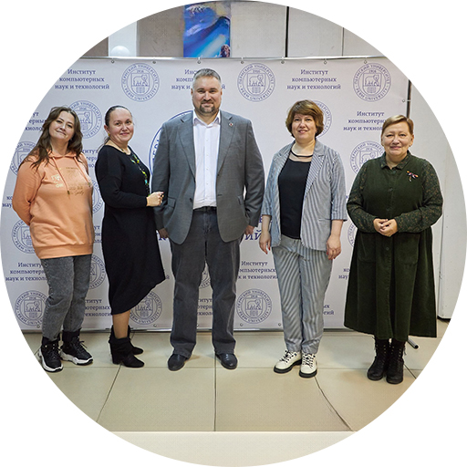
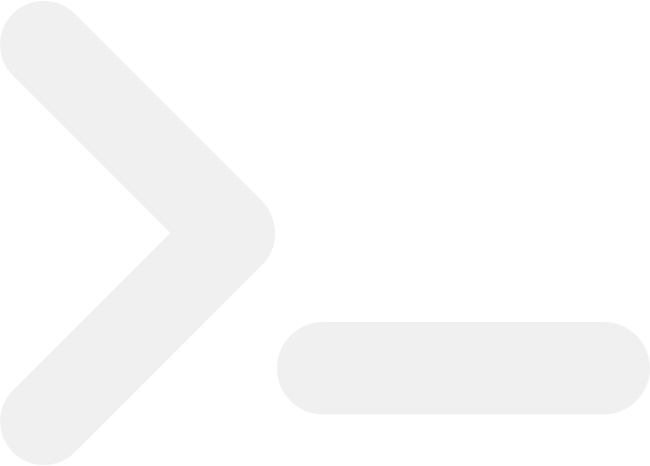
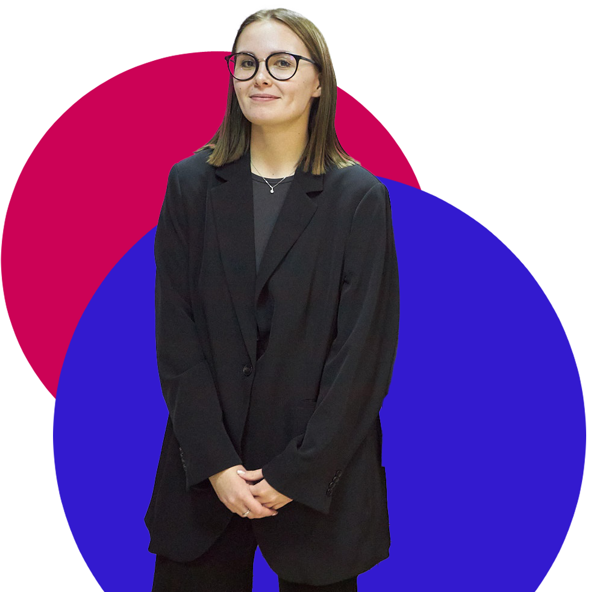

# Документация к HTML блоку "header" - Шапка

## Описаниеasdadasdasdasdasda

Блок `header` представляет собой заголовок веб-страницы Института компьютерных наук и технологий Пермского государственного национального исследовательского университета. Этот блок включает в себя навигационное меню, логотип, кнопки для мобильной и десктопной версии сайта, а также текстовую информацию о вузе.

## Структура

### 1. Основной контейнер `header.header`

Основной контейнер блока, содержащий все элементы заголовка.

### 2. Навигация `nav.nav`

Содержит элементы навигационного меню и вспомогательные элементы управления. Атрибут `id="menu"` используется для ссылок и идентификации.

#### 2.1. Контейнер навигации `div.content.nav-content`

Включает логотип, навигационную панель, кнопку поступления и элементы управления для мобильной версии.

#### 2.2. Логотип `img.logo`

Изображение логотипа университета. Используется атрибут `src="img/logo.png"` для указания пути к файлу изображения и `alt="logo"` для текстового описания.

#### 2.3. Навигационная панель `div.nav-bar`

Содержит ссылки на основные разделы сайта. Каждый элемент навигации представлен в виде `div.nav-item`, внутри которого находится ссылка `a.menu-link`.

##### Ссылки навигации:

- `href="#about"` - Об институте
- `href="#faculties"` - Направления
- `href="#advantages"` - Преимущества
- `href="#tracks"` - Треки
- `href="#curriculum"` - Учебные планы
- `href="#about_entering"` - Про поступление
- `href="#comments"` - Отзывы

#### 2.4. Кнопка "Поступить" `button.go_iknt.menu-link`

Кнопка для перехода на страницу поступления. Внутри кнопки находится текстовый элемент `p`.

#### 2.5. Бургер-меню `div.box_menu`

Элемент управления для мобильной версии сайта. Внутри содержит три полоски `div.menubar` для визуализации бургер-меню. При нажатии вызывает функцию `menu_active()`.

### 3. Навигация для мобильной версии `div.nav-bar-mobile`

Дополнительная навигационная панель, адаптированная для мобильных устройств. Содержит те же ссылки, что и `nav-bar`.

#### 3.1. Секция для мобильной версии `section#modal-message-mobile`

Секция содержит кнопку для написания сообщения `button.modal-button`, идентифицируемую через `id="write-button"`.

### 4. Контент заголовка `div.head`

Содержит текстовый контент заголовка, включающий название университета и информацию о вузе.

#### 4.1. Контент внутри заголовка `div.head-content`

Включает текстовые элементы:

- Название университета: `h2.h2-head`
- Название института: `h1.h1-head`
- Описание: `h3.h3-head`

#### 4.2. Заголовок раздела "Об институте" `h2.about__h2.desktop`

Текстовый заголовок раздела, предназначенный для десктопной версии сайта.

# Документация к блоку "Об институте"

## HTML структура

### Основной контейнер

```html
<section class="about" id="about"></section>
```

Элемент `<section>` с классом `about` и идентификатором `about`. Этот блок представляет собой секцию, содержащую информацию об институте.

### Заголовок

```html
<h2 class="about__h2 mobile">Об институте</h2>
```

Заголовок второго уровня с классом `about__h2 mobile`, отображается только на мобильных устройствах.

### Контентный контейнер

```html
<div class="content about__content"></div>
```

Контейнер с классами `content` и `about__content`, который включает весь контент секции.

### Изображения

```html
<div class="about__img">
  
  
  
</div>
```

Блок с изображениями. По умолчанию, отображается только первое изображение (`display: block`), остальные скрыты (`display: none`).

### Слайдер

```html
<div class="slider_box">
  <div class="about__arrow_box" id="arrow_up">
    
  </div>
  <div class="slider">
    <!-- Слайды -->
  </div>
  <div class="about__arrow_box" id="arrow_down">
    
  </div>
</div>
```

Блок слайдера, включающий стрелки для навигации вверх и вниз (`arrow_up` и `arrow_down`), и контейнер для слайдов (`slider`).

### Слайды

```html
<div class="slide">
  <div class="about__item__dec" id="about_dec1"></div>
  <p><span class="highlight">...</span> ...</p>
</div>
```

Каждый слайд представлен элементом `div` с классом `slide`. Внутри находится декоративный элемент `about__item__dec` и текст с выделениями (`highlight`).

### Навигационные точки

```html
<div class="about_points">
  <div class="about_point"></div>
  <div class="about_point"></div>
  <div class="about_point"></div>
  <div class="about_point active"></div>
  <div class="about_point"></div>
  <div class="about_point"></div>
  <div class="about_point"></div>
  <div class="about_point"></div>
</div>
```

Элементы навигации, представляющие точки для перехода между слайдами. Активная точка имеет класс `active`.

## Стили CSS

### .about

Основной контейнер секции.

### .about\_\_h2

Заголовок секции:

- `mobile` - класс для мобильной версии.

### .about\_\_content

Контейнер для основного контента секции.

### .about\_\_img

Контейнер для изображений.

### .slider_box

Контейнер для слайдера, включает стрелки навигации и сами слайды.

### .about\_\_arrow_box

Контейнер для стрелок навигации.

### .about\_\_arrow

Стили для изображения стрелок.

### .slider

Контейнер для всех слайдов.

### .slide

Стили для каждого отдельного слайда.

### .about**item**dec

Декоративный элемент внутри каждого слайда.

### .highlight

Стили для выделения текста внутри слайдов.

### .about_points

Контейнер для точек навигации.

### .about_point

Стили для каждой точки навигации.

### .active

Класс для активной точки навигации.

# Документация к блоку "faculties"

## HTML структура

### Основной контейнер

```html
<section class="faculties" id="faculties"></section>
```

Элемент `<section>` с классом `faculties` и идентификатором `faculties`. Этот блок представляет собой секцию, содержащую информацию о различных направлениях института.

### Контентный контейнер

```html
<div class="content faculties-content"></div>
```

Контейнер с классами `content` и `faculties-content`, который включает весь контент секции.

### Заголовок

```html
<h2 class="faculties__title">Направления</h2>
```

Заголовок второго уровня с классом `faculties__title`, представляющий название секции "Направления".

### Элементы направлений

Каждое направление представлено следующим образом:

```html
<div class="faculties__item hidden" id="faculties__item1">
  <div class="facultie__name">Прикладная математика и информатика</div>
  <div class="facultie__info">
    <div class="facultie__info__item">
      <h3 class="facultie__info__item__pts">160</h3>
      <div class="facultie__info__item__pts_info">Бюджетных мест</div>
    </div>
    <div class="facultie__info__item">
      <h3 class="facultie__info__item__pts">163</h3>
      <div class="facultie__info__item__pts_info">Проходной балл</div>
    </div>
    <div class="facultie__info__item">
      <h3 class="facultie__info__item__pts">216</h3>
      <div class="facultie__info__item__pts_info">Средний балл</div>
    </div>
  </div>
</div>
```

Каждое направление находится в элементе `div` с классом `faculties__item` и уникальным идентификатором (`faculties__item1`, `faculties__item2`, и т.д.). Класс `hidden` скрывает элемент до активации.

#### Название направления

```html
<div class="facultie__name">Прикладная математика и информатика</div>
```

Элемент с классом `facultie__name`, содержащий название направления.

#### Информация о направлении

```html
<div class="facultie__info">
  <div class="facultie__info__item">
    <h3 class="facultie__info__item__pts">160</h3>
    <div class="facultie__info__item__pts_info">Бюджетных мест</div>
  </div>
  <!-- Другие элементы информации -->
</div>
```

Элемент с классом `facultie__info`, содержащий различные информационные блоки о направлении.

##### Информационные блоки

Каждый блок информации представлен следующим образом:

```html
<div class="facultie__info__item">
  <h3 class="facultie__info__item__pts">160</h3>
  <div class="facultie__info__item__pts_info">Бюджетных мест</div>
</div>
```

Элементы с классом `facultie__info__item`, содержащие числовое значение (`facultie__info__item__pts`) и описание (`facultie__info__item__pts_info`).

### Новое направление

Для нового направления добавлен специальный маркер:

```html
<div class="facultie__info__item__new">Новое направление!</div>
```

Элемент с классом `facultie__info__item__new`, указывающий на новое направление.

## Стили CSS

### .faculties

Основной контейнер секции направлений.

### .faculties\_\_title

Заголовок секции направлений.

### .faculties-content

Контейнер для основного контента секции.

### .faculties\_\_item

Контейнер для каждого направления, скрытый по умолчанию (класс `hidden`).

### .facultie\_\_name

Стили для названия направления.

### .facultie\_\_info

Контейнер для информационных блоков о направлении.

### .facultie**info**item

Контейнер для отдельного информационного блока.

### .facultie**info**item\_\_pts

Числовое значение в информационном блоке.

### .facultie**info**item\_\_pts_info

Описание числового значения в информационном блоке.

### .facultie**info**item\_\_new

Маркер для нового направления.

# Документация к блоку "Преимущества"

## HTML структура

### Основной контейнер

```html
<section class="advantages" id="advantages"></section>
```

Элемент `<section>` с классом `advantages` и идентификатором `advantages`. Этот блок представляет собой секцию, содержащую информацию о преимуществах учебной программы.

### Контентный контейнер

```html
<div class="content advantages__content"></div>
```

Контейнер с классами `content` и `advantages__content`, который включает весь контент секции.

### Заголовок

```html
<h2 class="advantages__title">Преимущества</h2>
```

Заголовок второго уровня с классом `advantages__title`, представляющий название секции "Преимущества".

### Элементы преимуществ

Каждое преимущество представлено следующим образом:

```html
<div class="advantages__item">
  <div class="advantages__icon">
    
  </div>
  <div class="advantages__text">
    <h3
      class="advantages__text__title hidden_left_right"
      id="advantages__text__title1"
    >
      Обучение по вашим правилам
    </h3>
    <p class="advantages__text__p hidden_left_right" id="advantages__text__p1">
      вы сами формируете четверть учебной программы, подстраивая её под свои
      интересы
    </p>
  </div>
</div>
```

Каждое преимущество находится в элементе `div` с классом `advantages__item`.

#### Иконка преимущества

```html
<div class="advantages__icon">
  
</div>
```

Элемент с классом `advantages__icon`, содержащий иконку преимущества.

#### Текст преимущества

```html
<div class="advantages__text">
  <h3
    class="advantages__text__title hidden_left_right"
    id="advantages__text__title1"
  >
    Обучение по вашим правилам
  </h3>
  <p class="advantages__text__p hidden_left_right" id="advantages__text__p1">
    вы сами формируете четверть учебной программы, подстраивая её под свои
    интересы
  </p>
</div>
```

Элемент с классом `advantages__text`, содержащий заголовок и описание преимущества.

##### Заголовок преимущества

```html
<h3
  class="advantages__text__title hidden_left_right"
  id="advantages__text__title1"
>
  Обучение по вашим правилам
</h3>
```

Элемент с классом `advantages__text__title` и идентификатором `advantages__text__title1`, содержащий заголовок преимущества. Класс `hidden_left_right` используется для анимации при прокрутке.

##### Описание преимущества

```html
<p class="advantages__text__p hidden_left_right" id="advantages__text__p1">
  вы сами формируете четверть учебной программы, подстраивая её под свои
  интересы
</p>
```

Элемент с классом `advantages__text__p` и идентификатором `advantages__text__p1`, содержащий описание преимущества. Класс `hidden_left_right` используется для анимации при прокрутке.

### Пример других преимуществ

Другие преимущества следуют аналогичной структуре:

```html
<div class="advantages__item">
  <div class="advantages__icon">
    
  </div>
  <div class="advantages__text">
    <h3
      class="advantages__text__title hidden_left_right"
      id="advantages__text__title2"
    >
      Практика, <br />а не теория
    </h3>
    <p class="advantages__text__p hidden_left_right" id="advantages__text__p2">
      почти половина учебного времени посвящена практическим занятиям и
      стажировкам
    </p>
  </div>
</div>

<div class="advantages__item">
  <div class="advantages__icon">
    
  </div>
  <div class="advantages__text">
    <h3
      class="advantages__text__title hidden_left_right"
      id="advantages__text__title3"
    >
      Адаптация под потребности рынка
    </h3>
    <p
      class="advantages__text__p advantages__shors_text hidden_left_right"
      id="advantages__text__p3"
    >
      учебный план составлен на основе вакансий крупных IT-компаний
    </p>
  </div>
</div>
```

## Стили CSS

### .advantages

Основной контейнер секции преимуществ.

### .advantages\_\_title

Заголовок секции преимуществ.

### .advantages\_\_content

Контейнер для основного контента секции.

### .advantages\_\_items

Контейнер для всех элементов преимуществ.

### .advantages\_\_item

Контейнер для каждого преимущества.

### .advantages\_\_icon

Стили для иконки преимущества.

### .advantages\_\_text

Стили для текста преимущества.

### .advantages**text**title

Стили для заголовка преимущества.

### .advantages**text**p

Стили для описания преимущества.

### .hidden_left_right

Класс для анимации элементов при прокрутке.

### .advantages\_\_shors_text

Класс для коротких текстов описания преимущества.

# Документация к блоку "Треки учебных программ"

## HTML структура

### Основной контейнер

```html
<section class="tracks" id="tracks"></section>
```

Элемент `<section>` с классом `tracks` и идентификатором `tracks`. Этот блок представляет собой секцию, содержащую информацию о треках учебных программ.

### Контентный контейнер

```html
<div class="content tracks__content"></div>
```

Контейнер с классами `content` и `tracks__content`, который включает весь контент секции.

### Заголовок

```html
<h2 class="tracks__title">Треки учебных программ</h2>
```

Заголовок второго уровня с классом `tracks__title`, представляющий название секции "Треки учебных программ".

### Описание треков

```html
<div class="tracks__text">
  <p>
    За каждой учебной программой закреплены треки - наборы специальных
    дисциплин, определяющих специализацию. Распределение происходит на основании
    предпочтений обучающегося и успеваемости.
  </p>
  <p>
    Студентам всех направлений по окончании изучения базовых дисциплин
    предлагаются на выбор различные треки:
  </p>
</div>
```

Элемент `div` с классом `tracks__text`, содержащий описание треков учебных программ и процесс их выбора.

### Элементы треков

Контейнеры для каждого блока треков:

```html
<div class="tracks__separate_blocks" id="tracks__separate_blocks">
  <div class="tracks__item" id="tracks__item1">
    <ul class="tracks__animation_text hidden_left" id="tracks__item_left">
      <li>FullStack</li>
      <li>Робототехника</li>
      <li>Беспилотные авиационные системы</li>
      <li>Инженерия программного обеспечения</li>
      <li>Компьютерная лингвистика</li>
      <li>Мобильная разработка</li>
      <li>Информационные системы предприятий</li>
    </ul>
  </div>
  <div class="tracks__item" id="tracks__item2">
    <ul class="tracks__animation_text hidden_right" id="tracks__item_right">
      <li>Backend</li>
      <li>Frontend</li>
      <li>Проектное управление в ИТ-сфере</li>
      <li>Искусственный интеллект и</li>
      <li>большие данные</li>
      <li>Devops и администрирование</li>
      <li>Системное программирование</li>
    </ul>
  </div>
</div>
```

Каждый блок треков представлен в элементе `div` с классом `tracks__item` и уникальным идентификатором.

#### Список треков

Списки треков представлены следующим образом:

```html
<ul class="tracks__animation_text hidden_left" id="tracks__item_left">
  <li>FullStack</li>
  <li>Робототехника</li>
  <li>Беспилотные авиационные системы</li>
  <li>Инженерия программного обеспечения</li>
  <li>Компьютерная лингвистика</li>
  <li>Мобильная разработка</li>
  <li>Информационные системы предприятий</li>
</ul>
```

Каждый список имеет класс `tracks__animation_text` и классы для анимации: `hidden_left` или `hidden_right`. Элементы списка `<li>` содержат названия треков.

## Стили CSS

### .tracks

Основной контейнер секции треков.

### .tracks\_\_title

Заголовок секции треков.

### .tracks\_\_content

Контейнер для основного контента секции.

### .tracks\_\_text

Стили для текста описания треков.

### .tracks\_\_separate_blocks

Контейнер для блоков треков.

### .tracks\_\_item

Контейнер для каждого отдельного блока треков.

### .tracks\_\_animation_text

Стили для анимации текста треков.

### .hidden_left

Класс для анимации элементов при прокрутке (анимация слева).

### .hidden_right

Класс для анимации элементов при прокрутке (анимация справа).

# Техническая документация для секции "Про направления"

## Описание

Секция "Про направления" предназначена для представления информации о различных учебных направлениях, предлагаемых факультетами. Секция содержит блоки с описанием каждого направления, включая название, код, отрасли и краткое описание. Вёрстка выполнена с использованием HTML и CSS.

## Структура HTML

### Корневой элемент

```html
<section class="about_faculties">
  <div class="content">
    <h2>Про направления</h2>
    <!-- Элементы направлений -->
  </div>
</section>
```

### Элементы направлений

Каждое направление представлено в блоке с классом `about_faculties__item`. Пример для одного направления:

```html
<div class="about_faculties__item">
  <div class="about_faculties__title">
    <div class="about_faculties__decoration"></div>
    <h3 class="about_faculties__h3" id="about_faculties__h3_1">
      Прикладная математика и информатика
    </h3>
  </div>
  <div
    class="about_faculties__top_animation_area"
    id="about_faculties__top_animation_area_1"
  >
    <div class="about_faculties__text_box">
      <div class="about_faculties__animation_area">
        <div class="about_faculties__text">
          <h4 class="about_faculties__text__title">
            "Искусственный интеллект и большие данные"
          </h4>
          <div class="about_faculties__info">
            <p class="about_faculties__text__p">Код направления: 01.03.02</p>
            <p class="about_faculties__text__p">
              Отрасли: Machine Learning, Data science
            </p>
            <p class="about_faculties__text__p">
              Траектория обучения позволяет получить актуальные знания в
              программировании, анализе данных, математическом моделировании и
              искусственном интеллекте
            </p>
          </div>
        </div>
      </div>
    </div>
  </div>
</div>
```

### Повторение блоков

Структура повторяется для каждого направления. Направления чередуются с дополнительным классом `about_faculties__item__left` для изменения расположения:

```html
<div class="about_faculties__item about_faculties__item__left">
  <!-- Содержание блока -->
</div>
```

## CSS Классы

- `.about_faculties`: Корневой элемент секции.
- `.content`: Контейнер для содержания секции.
- `.about_faculties__item`: Основной блок для каждого направления.
- `.about_faculties__item__left`: Дополнительный класс для изменения расположения блока.
- `.about_faculties__title`: Заголовок направления.
- `.about_faculties__decoration`: Декоративный элемент перед заголовком.
- `.about_faculties__h3`: Заголовок направления (h3).
- `.about_faculties__top_animation_area`: Анимационная область.
- `.about_faculties__text_box`: Текстовый контейнер.
- `.about_faculties__animation_area`: Область анимации.
- `.about_faculties__text`: Основной текстовый блок.
- `.about_faculties__text__title`: Заголовок текста (h4).
- `.about_faculties__info`: Информационный блок.
- `.about_faculties__text__p`: Параграф текста.

## Пример использования

Чтобы добавить новое направление, скопируйте и вставьте следующий шаблон, заменив содержимое на соответствующее:

```html
<div class="about_faculties__item">
  <div class="about_faculties__title">
    <div class="about_faculties__decoration"></div>
    <h3 class="about_faculties__h3" id="about_faculties__h3_X">
      Название факультета
    </h3>
  </div>
  <div
    class="about_faculties__top_animation_area"
    id="about_faculties__top_animation_area_X"
  >
    <div class="about_faculties__text_box">
      <div class="about_faculties__animation_area">
        <div class="about_faculties__text">
          <h4 class="about_faculties__text__title">"Название направления"</h4>
          <div class="about_faculties__info">
            <p class="about_faculties__text__p">Код направления: X</p>
            <p class="about_faculties__text__p">Отрасли: X</p>
            <p class="about_faculties__text__p">Описание направления</p>
          </div>
        </div>
      </div>
    </div>
  </div>
</div>
```

Замените `X` и текстовые значения на соответствующие данные для нового направления.

# Техническая документация для секции "Учебные планы"

## Описание

Секция "Учебные планы" предоставляет информацию о различных учебных планах, доступных для студентов. Секция имеет две версии: для настольных компьютеров (desktop) и мобильных устройств (mobile). В каждой версии представлена информация о трех учебных планах с возможностью загрузки PDF-файлов.

## Структура HTML

### Корневой элемент

Для настольных устройств:

```html
<section class="curriculum desktop" id="curriculum">
  <h2>Учебные планы</h2>
  <div class="content curriculum__content">
    <!-- Элементы учебных планов -->
  </div>
</section>
```

Для мобильных устройств:

```html
<section class="curriculum mobile">
  <h2>Учебные планы</h2>
  <div class="curriculum__content">
    <!-- Элементы учебных планов -->
  </div>
</section>
```

### Элементы учебных планов

Каждый учебный план представлен в блоке с классом `curriculum__item`. Пример для одного учебного плана для настольных устройств:

```html
<div class="curriculum__item">
  <div class="curriculum__decoration"></div>
  <div class="curriculum__text">
    <a
      href="files/educational_programs.pdf"
      download="educational_programs.pdf"
    >
      <h3 class="curriculum__h3">Название учебного плана</h3>
    </a>
    <ul>
      <li>Описание пункта 1</li>
      <li>Описание пункта 2</li>
      <li>Описание пункта 3</li>
    </ul>
  </div>
</div>
```

Пример для мобильных устройств:

```html
<div class="curriculum__item">
  <div class="curriculum__button" id="curriculum__buttonX">
    Название учебного плана
  </div>
  <div class="curriculum__info" id="curriculum__infoX">
    <ul>
      <li>Описание пункта 1</li>
      <li>Описание пункта 2</li>
      <li>Описание пункта 3</li>
    </ul>
  </div>
</div>
```

### Кнопка для сравнения учебных планов

Для мобильной версии добавлена кнопка для сравнения учебных планов:

```html
<a href="#" class="curriculum__link" target="_blank">Сравнить учебные планы</a>
```

## CSS Классы

### Общие классы

- `.curriculum`: Корневой элемент секции.
- `.content`: Контейнер для содержания секции.
- `.curriculum__item`: Основной блок для каждого учебного плана.
- `.curriculum__decoration`: Декоративный элемент перед текстом.
- `.curriculum__text`: Текстовый контейнер.
- `.curriculum__h3`: Заголовок учебного плана (h3).
- `.curriculum__link`: Ссылка для сравнения учебных планов (только для мобильной версии).

### Классы для мобильной версии

- `.curriculum__button`: Кнопка для открытия информации о учебном плане.
- `.curriculum__info`: Контейнер для информации о учебном плане.

## Пример использования

### Добавление нового учебного плана для настольной версии

```html
<div class="curriculum__item">
  <div class="curriculum__decoration"></div>
  <div class="curriculum__text">
    <a
      href="files/new_educational_program.pdf"
      download="new_educational_program.pdf"
    >
      <h3 class="curriculum__h3">Новый учебный план</h3>
    </a>
    <ul>
      <li>Описание пункта 1</li>
      <li>Описание пункта 2</li>
      <li>Описание пункта 3</li>
    </ul>
  </div>
</div>
```

### Добавление нового учебного плана для мобильной версии

```html
<div class="curriculum__item">
  <div class="curriculum__button" id="curriculum__buttonX">
    Новый учебный план
  </div>
  <div class="curriculum__info" id="curriculum__infoX">
    <ul>
      <li>Описание пункта 1</li>
      <li>Описание пункта 2</li>
      <li>Описание пункта 3</li>
    </ul>
  </div>
</div>
```

### Замена значений `X`

Замените `X` на соответствующий номер или идентификатор для обеспечения уникальности ID, например `curriculum__button4` и `curriculum__info4` для следующего нового учебного плана.

# Техническая документация для секции "Кому подойдёт обучение в институте?"

## Описание

Секция "Кому подойдёт обучение в институте?" предназначена для информирования потенциальных студентов о том, кому подходит обучение в институте. Секция содержит три блока с изображениями и краткими описаниями.

## Структура HTML

### Корневой элемент

```html
<section class="for_who">
  <div class="for_who__title">
    <h2>Кому подойдёт обучение в институте?</h2>
  </div>
  <div class="content for_who__content">
    <!-- Элементы целевой аудитории -->
  </div>
  <script src="script/for_who.js"></script>
</section>
```

### Элементы целевой аудитории

Каждый блок целевой аудитории представлен в элементе с классом `for_who__item`. Пример для одного элемента:

```html
<div class="for_who__item">
  <div class="for_who__img">
    
  </div>
  <p>тем, кто углублённо занимался информатикой в школе</p>
</div>
```

### Повторение блоков

Структура повторяется для каждого элемента целевой аудитории:

```html
<div class="for_who__item">
  <div class="for_who__img">
    
  </div>
  <p>тем, кто не определился с будущей профессией в ИТ</p>
</div>
<div class="for_who__item">
  <div class="for_who__img">
    
  </div>
  <p>тем, кто профессионально занимается программированием</p>
</div>
```

## CSS Классы

- `.for_who`: Корневой элемент секции.
- `.for_who__title`: Контейнер для заголовка секции.
- `.for_who__content`: Контейнер для элементов целевой аудитории.
- `.for_who__item`: Основной блок для каждого элемента целевой аудитории.
- `.for_who__img`: Контейнер для изображения.
- `.for_who__img img`: Изображение внутри блока.
- `.for_who__text`: Текстовое описание.

## Пример использования

Чтобы добавить новый элемент целевой аудитории, скопируйте и вставьте следующий шаблон, заменив содержимое на соответствующее:

```html
<div class="for_who__item">
  <div class="for_who__img">
    
  </div>
  <p>новое описание целевой аудитории</p>
</div>
```

# Техническая документация для секции "Про поступление"

## Описание

Секция "Про поступление" предоставляет важную информацию для абитуриентов о сроках, вступительных испытаниях, необходимых предметах для сдачи ЕГЭ, индивидуальных достижениях и работе приемной комиссии. Секция адаптирована для настольных и мобильных устройств.

## Структура HTML

### Версия для настольных устройств

```html
<section class="about_entering desktop" id="about_entering">
  <h2>Про поступление</h2>
  <div class="content entering__content">
    <div class="entering__buttons">
      <button class="entering__button" id="entering_button1">
        Основные <br />даты поступления
      </button>
      <button class="entering__button" id="entering_button2">
        Вступительные <br />
        испытания - МФТИ
      </button>
      <button class="entering__button" id="entering_button3">
        Предметы <br />
        для сдачи ЕГЭ
      </button>
      <button class="entering__button" id="entering_button4">
        Индивидуальные <br />достижения
      </button>
      <button class="entering__button" id="entering_button5">
        Работа <br />
        приемной комиссии
      </button>
      <button class="entering__button" id="entering_button6">
        Поступление с<br />СПО
      </button>
    </div>
    <div class="entering__item" id="entering__item1">
      
      <div class="entering__text">
        <p>Основные сроки приема документов: с 20 июня до 25 июля до 12:00</p>
        <p>По договорной форме обучения: с 20 июня до 10 августа</p>
        <p>Сроки представления оригиналов документов:</p>
        <ul>
          <li>
            28 июля до 12:00 – для зачисления на места целевой, особой или
            специальной квоты
          </li>
          <li>
            3 августа до 12:00 – для зачисления по общему конкурсу на бюджетные
            места
          </li>
          <li>16 августа до 16:00 – для зачисления по договорам</li>
        </ul>
      </div>
    </div>
    <div class="entering__item" id="entering__item2">
      
      <div class="entering__text">
        <p>
          Вступительные испытания на сетевую программу с МФТИ проходят в очном
          формате в ПГНИУ по двум дисциплинам (математика и информатика) в два
          набора:
        </p>
        <ul>
          <li>Основной набор в конце июня</li>
          <li>Дополнительный набор в начале сентября</li>
        </ul>
        <p>Ознакомиться с примерами задач можно здесь</p>
      </div>
    </div>
    <div class="entering__item" id="entering__item3">
      
      <div class="entering__text">
        <p>Для поступления необходимо сдать ЕГЭ по предметам:</p>
        <ul>
          <li>Русский язык - 40 баллов</li>
          <li>Математика - 39 баллов</li>
          <li>Информатика и ИКТ - 44 балла или Физика - 39 баллов</li>
        </ul>
      </div>
    </div>
    <div class="entering__item" id="entering__item4">
      
      <div class="entering__text">
        <p>
          При поступлении в ИКНТ ПГНИУ начисляется 1 дополнительный балл к общей
          сумме баллов за:
        </p>
        <ul>
          <li>Золотой значок ГТО</li>
          <li>Аттестат с отличием</li>
          <li>Прохождение военной службы/участие в СВО</li>
        </ul>
        <p>
          Также Вы можете получить дополнительные баллы за
          <a
            class="href_btn"
            href="http://www.psu.ru/universitet/normativnye-dokumenty/bazovye-normativnye-dokumenty/pravila-priema/pravila-priema-v-2024-godu-bakalavriat-specialitet#c3"
            >олимпиады</a
          >
        </p>
      </div>
    </div>
    <div class="entering__item" id="entering__item5">
      
      <div class="entering__text">
        <p>Вы можете подать документы:</p>
        <ul>
          <li>
            Через портал государственных услуг Российской Федерации "Госуслуги"
          </li>
          <li>
            Через операторов почтовой связи по адресу: 614990, г. Пермь, ул.
            Букирева, д. 15, ПГНИУ, приемная комиссия.
          </li>
          <li>
            Лично в приемную комиссию по адресу: г. Пермь, ул. Дзержинского, д.
            2 (корпус № 5)
          </li>
        </ul>
        <p>Режим работы (без перерывов):</p>
        <ul>
          <li>10:00 - 18:00 пн-пт</li>
          <li>10:00-15:00 сб</li>
        </ul>
        <p>Задать вопросы по поступлению можно по номерам:</p>
        <ul>
          <li>+7 (342) 2-396-589</li>
          <li>+7 (342) 2-737-018</li>
        </ul>
      </div>
    </div>
    <div class="entering__item" id="entering__item6">
      
      <div class="entering__text">
        <p>ИКНТ открывает двери и для абитуриентов с СПО.</p>
        <p>Для поступления на направления</p>
        <ul>
          <li>Фундаментальная информатика и информационные технологии</li>
          <li>
            Инфокоммуникационные технологии и системы связи есть возможность
            пройти
            <a
              class="href_btn"
              href="http://www.psu.ru/obrazovanie/vysshee-obrazovanie/postuplenie-983475/bakalavriat-i-spetsialitet/profilnye-ekzameny-na-baze-spo"
              >вступительные испытания</a
            >.
          </li>
        </ul>
        <p>
          На иных направлениях рассматриваются только результаты ЕГЭ. <br />
          Ознакомиться с датами поступления можно
          <a
            class="href_btn"
            href="http://www.psu.ru/obrazovanie/vysshee-obrazovanie/postuplenie-983475/bakalavriat-i-spetsialitet/usloviya-priema"
            >здесь</a
          >
        </p>
      </div>
    </div>
  </div>
</section>
```

### Версия для мобильных устройств

```html
<section class="about_entering mobile" id="about_entering">
  <h2>Про поступление</h2>
  <div class="content entering__content">
    <div class="entering__buttons">
      <button class="entering__button" id="entering_button1">
        Основные <br />даты поступления
      </button>
      <div class="entering__item" id="entering__item1">
        
        <div class="entering__text">
          <p>
            Основные сроки приема документов: с 20 июня до 25 июля до 12:00*
          </p>
          <p>По договорной форме обучения: с 20 июня до 10 августа</p>
          <p>Сроки представления оригиналов документов:</p>
          <ul>
            <li>
              28 июля до 12:00* – для зачисления на места целевой, особой или
              специальной квоты
            </li>
            <li>
              3 августа до 12:00* – для зачисления по общему конкурсу на
              бюджетные места
            </li>
            <li>16 августа до 16:00* – для зачисления по договорам</li>
          </ul>
          <p>* по московскому времени</p>
        </div>
      </div>
      <button class="entering__button" id="entering_button2">
        Вступительные <br />
        испытания - МФТИ
      </button>
      <div class="entering__item" id="entering__item2">
        
        <div class="entering__text">
          <p>
            Вступительные испытания на сетевую программу с МФТИ проходят в очном
            формате в ПГНИУ по двум дисципли нам (математика и информатика) в
            два набора:
          </p>
          <ul>
            <li>Основной набор в конце июня</li>
            <li>Дополнительный набор в начале сентября</li>
          </ul>
          <p>Ознакомиться с примерами задач можно здесь</p>
        </div>
      </div>
      <button class="entering__button" id="entering_button3">
        Предметы <br />
        для сдачи ЕГЭ
      </button>
      <div class="entering__item" id="entering__item3">
        
        <div class="entering__text">
          <p>Для поступления необходимо сдать ЕГЭ по предметам:</p>
          <ul>
            <li>Русский язык - 40 баллов</li>
            <li>Математика - 39 баллов</li>
            <li>Информатика и ИКТ - 44 балла или Физика - 39 баллов</li>
          </ul>
        </div>
      </div>
      <button class="entering__button" id="entering_button4">
        Индивидуальные <br />достижения
      </button>
      <div class="entering__item" id="entering__item4">
        
        <div class="entering__text">
          <p>
            При поступлении в ИКНТ ПГНИУ начисляется 1 дополнительный балл к
            общей сумме баллов за:
          </p>
          <ul>
            <li>Золотой значок ГТО</li>
            <li>Аттестат с отличием</li>
            <li>Прохождение военной службы/участие в СВО</li>
          </ul>
          <p>
            Также Вы можете получить дополнительные баллы за
            <a
              class="href_btn"
              href="http://www.psu.ru/universitet/normativnye-dokumenty/bazovye-normativnye-dokumenty/pravila-priema/pravila-priema-v-2024-godu-bakalavriat-specialitet#c3"
              >олимпиады</a
            >
          </p>
        </div>
      </div>
      <button class="entering__button" id="entering_button5">
        Работа <br />
        приемной комиссии
      </button>
      <div class="entering__item" id="entering__item5">
        
        <div class="entering__text">
          <p>Вы можете подать документы:</p>
          <ul>
            <li>
              Через портал государственных услуг Российской Федерации
              "Госуслуги"
            </li>
            <li>
              Через операторов почтовой связи по адресу: 614990, г. Пермь, ул.
              Букирева, д. 15, ПГНИУ, приемная комиссия.
            </li>
            <li>
              Лично в приемную комиссию по адресу: г. Пермь, ул. Дзержинского,
              д. 2 (корпус № 5)
            </li>
          </ul>
          <p>Режим работы (без перерывов):</p>
          <ul>
            <li>10:00 - 18:00 пн-пт</li>
            <li>10:00-15:00 сб</li>
          </ul>
          <p>Задать вопросы по поступлению можно по номерам:</p>
          <ul>
            <li>+7 (342) 2-396-589</li>
            <li>+7 (342) 2-737-018</li>
          </ul>
        </div>
      </div>
      <button class="entering__button" id="entering_button6">
        Поступление с<br />СПО
      </button>
      <div class="entering__item" id="entering__item6">
        
        <div class="entering__text">
          <p>ИКНТ открывает двери и для абитуриентов с СПО.</p>
          <p>Для поступления на направления</p>
          <ul>
            <li>Фундаментальная информатика и информационные технологии</li>
            <li>
              Инфокоммуникационные технологии и системы связи есть возможность
              пройти
              <a
                class="href_btn"
                href="http://www.psu.ru/obrazovanie/vysshee-obrazovanie/postuplenie-983475/bakalavriat-i-spetsialitet/profilnye-ekzameny-na-baze-spo"
                >вступительные испытания</a
              >.
            </li>
          </ul>
          <p>
            На иных направлениях рассматриваются только результаты ЕГЭ. <br />
            Ознакомиться с датами поступления можно
            <a
              class="href_btn"
              href="http://www.psu.ru/obrazovanie/vysshee-obrazovanie/postuplenie-983475/bakalavriat-i-spetsialitet/usloviya-priema"
              >здесь</a
            >
          </p>
        </div>
      </div>
    </div>
  </div>
</section>
```

# Техническая документация для секции "Специальности" на сайте

## Описание

Секция "Специальности" представляет собой часть веб-страницы, которая отображает информацию о различных профессиональных направлениях. Она включает в себя название секции, значки и названия специальностей, а также краткое описание каждой из них.

## Структура HTML

```html
<section class="specialities">
  <h2>Специальности</h2>
  <div class="content specialities__content">
    <div class="specialities__item">
      <div class="specialities__icon">
        
      </div>
      <p class="spec__name">
        Information <br />
        Systems <br />
        Specialist
      </p>
      <p class="spec__about">
        Обеспечение работы и безопасности информационных систем компании
      </p>
    </div>
    <div class="specialities__item">
      <div class="specialities__icon">
        
      </div>
      <p class="spec__name">
        Product<br />
        Manager
      </p>
      <p class="spec__about">
        Управление жизненным циклом продукта от идеи до запуска
      </p>
    </div>
    <div class="specialities__item">
      <div class="specialities__icon">
        
      </div>
      <p class="spec__name">Developer</p>
      <p class="spec__about">
        Написание программного обеспечения для различных приложений и систем
      </p>
    </div>
    <div class="specialities__item">
      <div class="specialities__icon">
        
      </div>
      <p class="spec__name">
        Devops <br />
        Engineer
      </p>
      <p class="spec__about">
        Автоматизация процессов разработки и эксплуатации программного
        обеспечения для повышения его эффективности
      </p>
    </div>
    <div class="specialities__item">
      <div class="specialities__icon">
        
      </div>
      <p class="spec__name">
        Machine <br />
        Learning <br />
        Scientist
      </p>
      <p class="spec__about">
        Создание и улучшение моделей для анализа данных и разработки
        искусственного интеллекта
      </p>
    </div>
  </div>
</section>
```

## CSS Классы

### Общие стили

- `.specialities`: Основной контейнер для секции "Специальности".
- `.content`: Обертка для содержания секции.

### Стили для элементов

- `.specialities__content`: Контейнер для всех элементов специальностей.
- `.specialities__item`: Обертка для каждого элемента специальности.
- `.specialities__icon`: Контейнер для иконки специальности.
- `.spec__name`: Класс для названия специальности.
- `.spec__about`: Класс для описания специальности.

## Структура элементов

1. **Контейнер секции**:

   - `<section class="specialities">`: Начало секции "Специальности".
   - `<h2>Специальности</h2>`: Заголовок секции.

2. **Контент секции**:

   - `<div class="content specialities__content">`: Контейнер для всех элементов специальностей.

3. **Элемент специальности**:
   - `<div class="specialities__item">`: Обертка для одного элемента специальности.
   - `<div class="specialities__icon">`: Контейнер для иконки специальности.
     - ``: Иконка специальности.
   - `<p class="spec__name">`: Название специальности.
   - `<p class="spec__about">`: Описание специальности.

## Пример использования

Для добавления новой специальности в секцию, необходимо добавить новый блок `<div class="specialities__item">` внутри контейнера `.specialities__content` по аналогии с существующими элементами. Убедитесь, что у каждого элемента есть значок, название и описание.

Пример:

```html
<div class="specialities__item">
  <div class="specialities__icon">
    
  </div>
  <p class="spec__name">
    New<br />
    Speciality
  </p>
  <p class="spec__about">Описание новой специальности</p>
</div>
```
